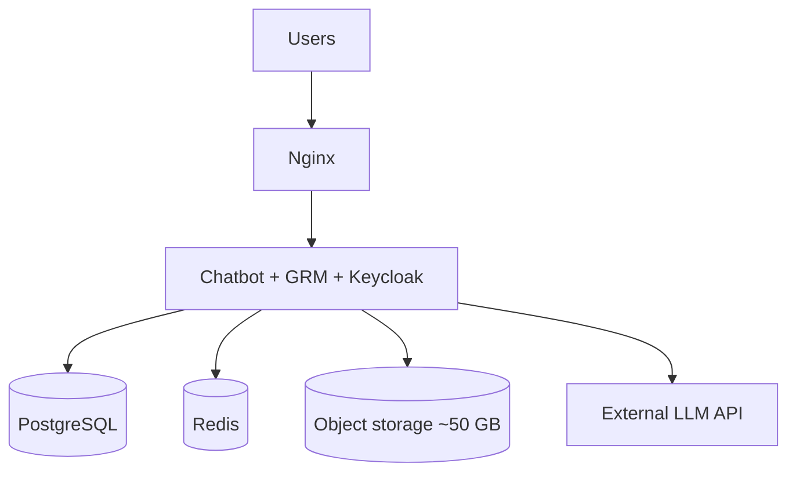

# Production server specification — Nepal GRM / chatbot stack

**Last updated:** 2026-05-27  
**Load:** ~10 concurrent chatbot users, ~100 concurrent GRM officers (browser sessions).

---

## 1. Compute

| Item             | Recommendation                         |
| ---------------- | -------------------------------------- |
| **Servers**      | 1× application server (Docker Compose) |
| **vCPU**         | 2                                      |
| **RAM**          | 8 GiB                                  |
| **OS**           | Ubuntu 22.04 or 24.04 LTS + Docker     |
| **Architecture** | ARM64 or x86_64                        |

LLM processing uses external APIs (no on-box GPU).

---

## 2. Storage

| Item              | Recommendation                                                |
| ----------------- | ------------------------------------------------------------- |
| **Root disk**     | 40–50 GB SSD, encrypted, snapshotted                          |
| **Root disk use** | OS, containers, PostgreSQL, Redis, logs                       |
| **Attachments**   | Object storage, ~50 GB, private, encrypted — not on root disk |

---

## Reference

### Stack (single host)

Chatbot: Nginx, orchestrator, backend API, Celery, Redis, PostgreSQL.  
GRM: ticketing API, officer UI (Next.js), Celery + beat, Keycloak.

External only: LLM API, SMS/email.

### Architecture

