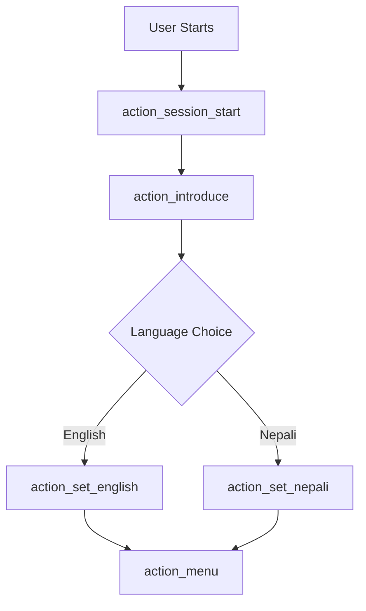
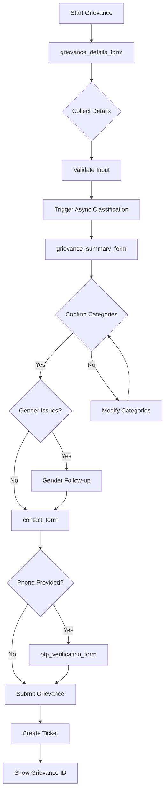
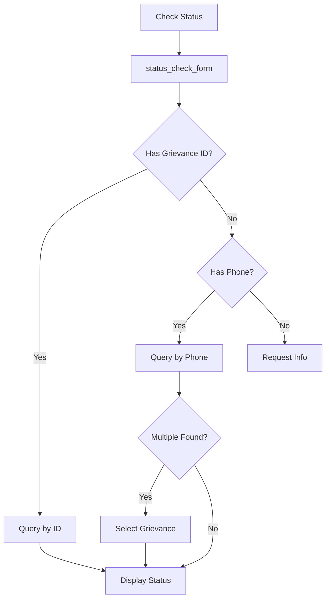

# Nepal Chatbot - Rasa Guide

Complete Rasa documentation covering conversation flows, forms, actions, NLU training, and async classification.

## Table of Contents

- [Overview](#overview)
- [Conversation Flows](#conversation-flows)
- [Forms and Validation](#forms-and-validation)
- [Custom Actions](#custom-actions)
- [Async Classification](#async-classification)
- [NLU Training](#nlu-training)
- [Multilingual Support](#multilingual-support)

## Overview

### Rasa Configuration

**Location:** `rasa_chatbot/`

**Key Files:**

- `config.yml` - NLU pipeline and policies
- `domain.yml` - Intents, entities, slots, responses, forms
- `endpoints.yml` - Action server and other endpoints
- `credentials.yml` - Channel credentials

**Rasa Version:** 3.6.21

### Starting Rasa

```bash
# Train model
cd rasa_chatbot
rasa train

# Start Rasa server
rasa run --enable-api --cors "*" --port 5005

# Start Action server
rasa run actions --port 5055

# Interactive mode (for testing)
rasa shell
```

### Rasa Architecture

```
User Message → Rasa Server → NLU Pipeline → Intent Classification
                    ↓
              Policy Prediction
                    ↓
              Action Execution → Action Server
                    ↓
              Response Generation → User
```

## Conversation Flows

### 1. Session Initiation & Language Selection



**Flow:**

1. User opens chatbot
2. System introduces itself in both languages
3. User selects preferred language
4. System sets language slot
5. Main menu is displayed

**Example:**

```
Bot: Welcome to the Grievance Reporting System.
     स्वागत छ गुनासो रिपोर्टिङ प्रणालीमा।
     Please select your language / कृपया आफ्नो भाषा चयन गर्नुहोस्।
     [English] [नेपाली]

User: [Clicks English]

Bot: Welcome! How can I help you today?
     [File a Grievance] [Check Status] [Exit]
```

### 2. Grievance Submission Flow



**Detailed Steps:**

#### Step 1: Collect Grievance Details

**Form:** `grievance_details_form`

**Slots:**

- `grievance_new_detail` - User's grievance description

**Validation:**

- Minimum length: 10 characters
- Maximum length: 5000 characters
- Skip allowed with confirmation

**Code:** `rasa_chatbot/actions/forms/form_grievance.py`

```python
class ValidateGrievanceDetailsForm(FormValidationAction):
    def validate_grievance_new_detail(self, value, dispatcher, tracker, domain):
        if len(value) < 10:
            dispatcher.utter_message(text="Please provide more details.")
            return {"grievance_new_detail": None}
        return {"grievance_new_detail": value}
```

#### Step 2: Async Classification

**Trigger:** After grievance details collection

**Process:**

1. Launch Celery task for classification
2. User proceeds to next form (non-blocking)
3. Classification runs in background
4. Results sent to frontend via WebSocket
5. Frontend sends results back to Rasa

**Task:** `classify_and_summarize_grievance_task`

```python
@celery_app.task(bind=True, max_retries=3)
def classify_and_summarize_grievance_task(self, grievance_data):
    # Call OpenAI for classification
    categories = classify_grievance(grievance_data['description'])
    summary = summarize_grievance(grievance_data['description'])

    return {
        'grievance_summary': summary,
        'grievance_categories': categories,
        'status': 'SUCCESS'
    }
```

#### Step 3: Confirm Summary & Categories

**Form:** `grievance_summary_form`

**Slots:**

- `grievance_summary_temp` - AI-generated summary
- `grievance_list_cat_confirmed` - User confirmation
- `grievance_summary_confirmed` - Summary confirmation

**Validation:**

- Check if classification completed
- Allow manual category selection
- Detect gender issues automatically

**Code:** `rasa_chatbot/actions/forms/form_validation_grievance_categories.py`

```python
class ActionAskGrievanceSummaryFormGrievanceListCatConfirmed(Action):
    def run(self, dispatcher, tracker, domain):
        # Check classification status
        classification_status = tracker.get_slot('classification_status')

        if classification_status == 'completed':
            categories = tracker.get_slot('grievance_categories')
            dispatcher.utter_message(
                text=f"Your grievance has been categorized as: {categories}. Is this correct?",
                buttons=[
                    {"title": "Yes", "payload": "/affirm"},
                    {"title": "No", "payload": "/deny"}
                ]
            )
        else:
            # Still processing
            dispatcher.utter_message(
                text="Classification is still processing. Please wait..."
            )
```

#### Step 4: Gender Issue Detection

**Automatic Detection:**

```python
def _detect_gender_issues(self, description, categories):
    gender_keywords = ['harassment', 'abuse', 'discrimination', 'violence']
    gender_categories = ['Gender-based Violence', 'Harassment']

    has_keywords = any(keyword in description.lower() for keyword in gender_keywords)
    has_category = any(cat in categories for cat in gender_categories)

    return has_keywords or has_category
```

**Follow-up Questions:**

- Complainant gender
- Alleged perpetrator gender
- Type of incident
- Date and location of incident

#### Step 5: Contact Information

**Form:** `contact_form`

**Slots:**

- `complainant_full_name`
- `complainant_phone`
- `complainant_email`
- `complainant_location_consent`
- `complainant_province`
- `complainant_district`
- `complainant_municipality`
- `complainant_ward`
- `complainant_village`
- `complainant_address`

**Validation:**

- Phone: Nepali format (+977-XXXXXXXXXX)
- Email: Valid email format (optional)
- Location: Valid province/district/municipality

#### Step 6: OTP Verification

**Form:** `otp_verification_form`

**Process:**

1. Generate 6-digit OTP
2. Send OTP via SMS (Celery task)
3. User enters OTP
4. Validate OTP (3 attempts)
5. Mark phone as verified

**Code:** `rasa_chatbot/actions/forms/form_contact.py`

```python
class ValidateOTPVerificationForm(FormValidationAction):
    def validate_otp_input(self, value, dispatcher, tracker, domain):
        expected_otp = tracker.get_slot('otp_code')

        if value == expected_otp:
            return {"otp_input": value, "phone_verified": True}
        else:
            attempts = tracker.get_slot('otp_attempts') or 0
            if attempts >= 3:
                dispatcher.utter_message(text="Too many failed attempts. Skipping verification.")
                return {"otp_input": None, "phone_verified": False}
            else:
                return {"otp_input": None, "otp_attempts": attempts + 1}
```

#### Step 7: Submit Grievance

**Action:** `action_submit_grievance`

**Process:**

1. Collect all slot values
2. Encrypt sensitive data
3. Store in database
4. Generate unique grievance ID
5. Create ticket in Django
6. Send confirmation
7. Send email (if provided)

**Code:** `rasa_chatbot/actions/generic_actions.py`

```python
class ActionSubmitGrievance(Action):
    def run(self, dispatcher, tracker, domain):
        # Collect data
        grievance_data = {
            'complainant_full_name': tracker.get_slot('complainant_full_name'),
            'complainant_phone': tracker.get_slot('complainant_phone'),
            'grievance_description': tracker.get_slot('grievance_description'),
            'grievance_summary': tracker.get_slot('grievance_summary'),
            'grievance_categories': tracker.get_slot('grievance_categories'),
        }

        # Store in database
        grievance_id = db_manager.create_grievance(grievance_data)

        # Create ticket
        ticket_manager.create_ticket(grievance_id)

        # Send confirmation
        dispatcher.utter_message(
            text=f"Your grievance has been submitted successfully. "
                 f"Your grievance ID is: {grievance_id}. "
                 f"Please save this ID for future reference."
        )

        return [SlotSet("grievance_id", grievance_id)]
```

### 3. Status Check Flow



**Flow:**

1. User requests status check
2. System asks for grievance ID or phone number
3. Query database for grievances
4. If multiple found, show list for selection
5. Display status, history, and attachments

**Example:**

```
Bot: Please provide your grievance ID or phone number.

User: +9771234567890

Bot: We found 2 grievances associated with this phone number.
     1. GRV001 - Water supply issue (Status: In Progress)
     2. GRV002 - Road damage (Status: Resolved)
     Please select one:
     [GRV001] [GRV002]

User: [Clicks GRV001]

Bot: Grievance ID: GRV001
     Status: In Progress
     Submitted: 2025-01-20
     Last Updated: 2025-01-25
     Summary: Inconsistent water supply in Ward 5
     Assigned To: Site Engineer

     Status History:
     - 2025-01-20: Submitted
     - 2025-01-21: Assigned to Site Engineer
     - 2025-01-25: Under Investigation

     You will be notified when there's an update.
```

## Forms and Validation

### Form Structure

**Location:** `rasa_chatbot/actions/forms/`

**Base Class:**

```python
from rasa_sdk.forms import FormValidationAction

class ValidateMyForm(FormValidationAction):
    def name(self) -> str:
        return "validate_my_form"

    def validate_slot_name(self, value, dispatcher, tracker, domain):
        # Validation logic
        if self.is_valid(value):
            return {"slot_name": value}
        else:
            dispatcher.utter_message(text="Invalid input. Please try again.")
            return {"slot_name": None}
```

### Available Forms

1. **grievance_details_form**

   - Collects grievance description
   - Multi-turn conversation
   - Allows adding more details

2. **grievance_summary_form**

   - Confirms AI-generated summary
   - Confirms categories
   - Handles gender issues

3. **contact_form**

   - Collects user information
   - Location details
   - Contact preferences

4. **otp_verification_form**

   - OTP generation and validation
   - Retry logic
   - Skip option

5. **status_check_form**
   - Grievance ID or phone input
   - Grievance selection (if multiple)

### Form Activation

**In domain.yml:**

```yaml
forms:
  grievance_details_form:
    required_slots:
      - grievance_new_detail

  contact_form:
    required_slots:
      - user_contact_consent
      - complainant_full_name
      - complainant_phone
      - user_location_consent
      - complainant_province
      - complainant_district
      - complainant_municipality
```

**In stories:**

```yaml
- story: grievance submission
  steps:
    - intent: file_grievance
    - action: action_start_grievance_process
    - action: grievance_details_form
    - active_loop: grievance_details_form
    - action: action_trigger_async_classification
    - action: grievance_summary_form
    - active_loop: grievance_summary_form
```

### Slot Mapping

**Request slots:**

```python
class ActionAskContactFormComplainantFullName(Action):
    def name(self) -> str:
        return "action_ask_contact_form_complainant_full_name"

    def run(self, dispatcher, tracker, domain):
        language = tracker.get_slot('language') or 'en'

        if language == 'ne':
            message = "कृपया आफ्नो पूरा नाम प्रदान गर्नुहोस्।"
        else:
            message = "Please provide your full name."

        dispatcher.utter_message(text=message)
        return []
```

## Custom Actions

### Action Types

1. **Generic Actions** - Menu, intro, goodbye
2. **Form Actions** - Form-related actions
3. **Validation Actions** - Slot validation
4. **Submission Actions** - Database operations
5. **Status Actions** - Status checking

### Action Examples

#### 1. Menu Action

```python
class ActionMenu(Action):
    def name(self) -> str:
        return "action_menu"

    def run(self, dispatcher, tracker, domain):
        language = tracker.get_slot('language') or 'en'

        if language == 'ne':
            text = "तपाईंलाई के मद्दत चाहिन्छ?"
            buttons = [
                {"title": "गुनासो दर्ता गर्नुहोस्", "payload": "/file_grievance"},
                {"title": "स्थिति जाँच गर्नुहोस्", "payload": "/check_status"},
                {"title": "बाहिर निस्कनुहोस्", "payload": "/goodbye"}
            ]
        else:
            text = "How can I help you today?"
            buttons = [
                {"title": "File a Grievance", "payload": "/file_grievance"},
                {"title": "Check Status", "payload": "/check_status"},
                {"title": "Exit", "payload": "/goodbye"}
            ]

        dispatcher.utter_message(text=text, buttons=buttons)
        return []
```

#### 2. Language Selection

```python
class ActionSetEnglish(Action):
    def name(self) -> str:
        return "action_set_english"

    def run(self, dispatcher, tracker, domain):
        return [SlotSet("language", "en")]

class ActionSetNepali(Action):
    def name(self) -> str:
        return "action_set_nepali"

    def run(self, dispatcher, tracker, domain):
        return [SlotSet("language", "ne")]
```

#### 3. Status Check Action

```python
class ActionCheckStatusById(Action):
    def name(self) -> str:
        return "action_check_status_by_id"

    def run(self, dispatcher, tracker, domain):
        grievance_id = tracker.get_slot('grievance_id')

        # Query database
        grievance = db_manager.get_grievance_by_id(grievance_id)

        if not grievance:
            dispatcher.utter_message(text=f"Grievance {grievance_id} not found.")
            return []

        # Get status history
        history = db_manager.get_status_history(grievance_id)

        # Format message
        message = f"Grievance ID: {grievance_id}\n"
        message += f"Status: {grievance['status']}\n"
        message += f"Summary: {grievance['summary']}\n\n"
        message += "Status History:\n"

        for entry in history:
            message += f"- {entry['created_at']}: {entry['new_status']}\n"

        dispatcher.utter_message(text=message)

        # Show attachments if any
        files = db_manager.get_files(grievance_id)
        if files:
            dispatcher.utter_message(text="Attachments:",
                                    attachments=[{"type": "file", "url": f['url']} for f in files])

        return []
```

## Async Classification

### Overview

Classification runs asynchronously to avoid blocking the conversation while waiting for OpenAI API responses.

### Flow

```
User submits details
       ↓
Action triggers Celery task
       ↓
User proceeds to summary form (non-blocking)
       ↓
Classification runs in background
       ↓
Results sent via WebSocket to frontend
       ↓
Frontend sends results to Rasa as user message
       ↓
Rasa processes results and updates slots
       ↓
Form validation checks classification status
       ↓
User sees results and confirms
```

### Implementation

#### 1. Trigger Classification

```python
class ActionTriggerAsyncClassification(Action):
    def name(self) -> str:
        return "action_trigger_async_classification"

    def run(self, dispatcher, tracker, domain):
        grievance_id = tracker.get_slot('grievance_id')
        description = tracker.get_slot('grievance_description')
        language = tracker.get_slot('language')

        # Launch async task
        task = classify_and_summarize_grievance_task.delay({
            'grievance_id': grievance_id,
            'description': description,
            'language': language
        })

        # Store task ID
        return [
            SlotSet("classification_task_id", task.id),
            SlotSet("classification_status", "processing")
        ]
```

#### 2. Check Classification Status

```python
class ActionCheckClassificationStatus(Action):
    def name(self) -> str:
        return "action_check_classification_status"

    def run(self, dispatcher, tracker, domain):
        task_id = tracker.get_slot('classification_task_id')

        if not task_id:
            return [SlotSet("classification_status", "skipped")]

        # Check Celery task status
        task = celery_app.AsyncResult(task_id)

        if task.ready():
            result = task.result
            return [
                SlotSet("classification_status", "completed"),
                SlotSet("grievance_summary", result['summary']),
                SlotSet("grievance_categories", result['categories'])
            ]
        else:
            return [SlotSet("classification_status", "processing")]
```

#### 3. Handle Classification Results

**Frontend sends results:**

```javascript
// Frontend receives WebSocket event
socket.on("task_status", (data) => {
  if (
    data.task_name === "classify_and_summarize_grievance_task" &&
    data.status === "SUCCESS"
  ) {
    // Send results to Rasa
    sendMessageToRasa(`/classification_results${JSON.stringify(data.result)}`);
  }
});
```

**Rasa handles results:**

```python
class ActionHandleClassificationResults(Action):
    def name(self) -> str:
        return "action_handle_classification_results"

    def run(self, dispatcher, tracker, domain):
        # Extract data from message
        message = tracker.latest_message.get('text', '')

        # Parse JSON
        json_match = re.search(r'\{.*\}', message)
        if json_match:
            data = json.loads(json_match.group())

            return [
                SlotSet("grievance_summary", data.get('grievance_summary')),
                SlotSet("grievance_categories", data.get('grievance_categories')),
                SlotSet("classification_status", "completed")
            ]

        return []
```

### Benefits

1. **Non-blocking**: User doesn't wait for AI processing
2. **Better UX**: Conversation continues smoothly
3. **Automatic retries**: Celery handles failures
4. **Scalability**: Multiple classifications can run in parallel
5. **Resilience**: Fallback if classification fails

## NLU Training

### Training Data Location

```
rasa_chatbot/data/
├── nlu/
│   ├── nlu.yml                    # Main NLU data
│   ├── nlu_english.yml            # English examples
│   └── nlu_nepali.yml             # Nepali examples
├── stories/
│   ├── grievance_stories.yml     # Grievance flows
│   ├── status_stories.yml        # Status check flows
│   └── navigation_stories.yml    # Navigation flows
└── rules/
    └── rules.yml                  # Rules for forms and fallback
```

### Adding New Intent

**1. Add examples in nlu.yml:**

```yaml
- intent: new_intent
  examples: |
    - example message 1
    - example message 2
    - example message 3
    - example message 4 (minimum 4 examples)
```

**2. Add to domain.yml:**

```yaml
intents:
  - new_intent
```

**3. Create action (if needed):**

```python
class ActionHandleNewIntent(Action):
    def name(self) -> str:
        return "action_handle_new_intent"

    def run(self, dispatcher, tracker, domain):
        # Handle intent
        dispatcher.utter_message(text="Handling new intent...")
        return []
```

**4. Add story:**

```yaml
- story: handle new intent
  steps:
    - intent: new_intent
    - action: action_handle_new_intent
```

**5. Retrain model:**

```bash
rasa train
```

### Training Tips

- **Minimum examples**: 10-15 per intent
- **Diverse examples**: Various phrasings and lengths
- **Entity variations**: Different entity values
- **Typos and variations**: Real-world input
- **Negative examples**: What NOT to match

### NLU Pipeline

**config.yml:**

```yaml
language: en
pipeline:
  - name: WhitespaceTokenizer
  - name: RegexFeaturizer
  - name: LexicalSyntacticFeaturizer
  - name: CountVectorsFeaturizer
  - name: CountVectorsFeaturizer
    analyzer: char_wb
    min_ngram: 1
    max_ngram: 4
  - name: DIETClassifier
    epochs: 100
    constrain_similarities: true
  - name: EntitySynonymMapper
  - name: ResponseSelector
    epochs: 100
    constrain_similarities: true
  - name: FallbackClassifier
    threshold: 0.3
    ambiguity_threshold: 0.1
```

### Testing NLU

```bash
# Test NLU only
rasa test nlu --nlu data/nlu

# Cross-validation
rasa test nlu --nlu data/nlu --cross-validation

# Test specific intent
rasa shell nlu
```

## Multilingual Support

### Supported Languages

- **English** (en)
- **Nepali** (ne)

### Language Detection

```python
def detect_language(text):
    """Detect language from text."""
    nepali_chars = set('अआइईउऊएऐओऔकखगघङचछजझञटठडढणतथदधनपफबभमयरलवशषसह')

    if any(char in nepali_chars for char in text):
        return 'ne'
    return 'en'
```

### Response Templates

**domain.yml:**

```yaml
responses:
  utter_greet:
    - text: "Hello! Welcome to the Grievance Reporting System."
      metadata:
        language: en
    - text: "नमस्ते! गुनासो रिपोर्टिङ प्रणालीमा स्वागत छ।"
      metadata:
        language: ne
```

**In actions:**

```python
def get_response(key, language):
    responses = {
        'greet': {
            'en': 'Hello! Welcome.',
            'ne': 'नमस्ते! स्वागत छ।'
        }
    }
    return responses.get(key, {}).get(language, responses[key]['en'])
```

### Translation Service

```python
# task_queue/tasks/translation.py

@celery_app.task
def translate_text_task(text, source_lang, target_lang):
    """Translate text using OpenAI."""
    response = openai.ChatCompletion.create(
        model="gpt-4",
        messages=[
            {"role": "system", "content": f"Translate from {source_lang} to {target_lang}"},
            {"role": "user", "content": text}
        ]
    )
    return response.choices[0].message.content
```

---

For backend integration and operations, see:

- [Backend Guide](BACKEND.md)
- [Operations Guide](OPERATIONS.md)
