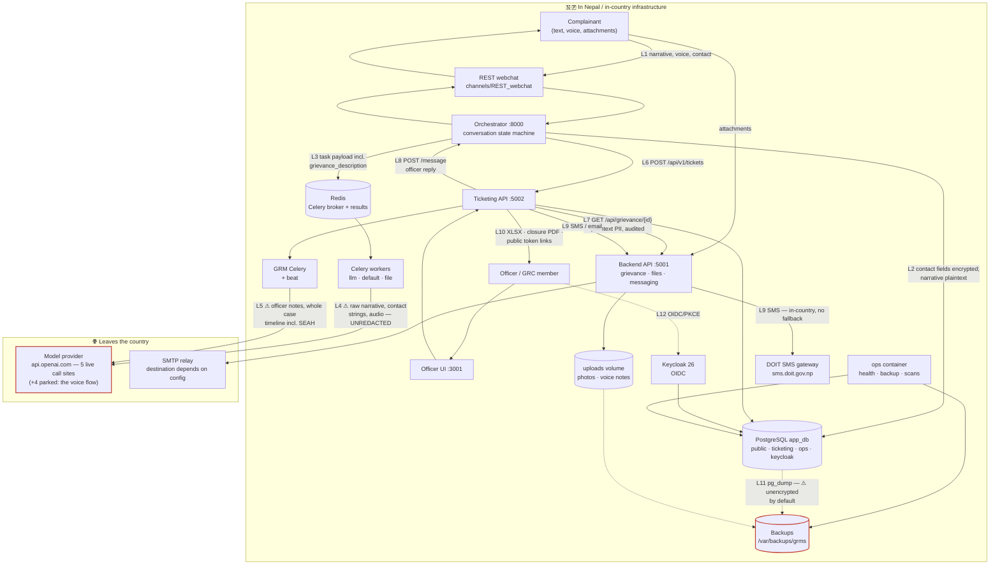

# Privacy assessment and data-flow inventory

**Nepal GRM Platform** — Grievance Redress Mechanism for ADB-financed road infrastructure
(Kakarbhitta–Laukahi Road, ADB Loan 52097-003)

**Version:** 1.1 · **Date:** 2026-08-24
**Benchmark:** Nepal's **Individual Privacy Act, 2075 (2018)** — the sole benchmark (see §0.3)
**Covers:** DPG Standard indicators **7** (privacy), **9** (do no harm) and **9a** (data privacy and security)

---

## 0. Read this before anything else

### 0.1 Who wrote this, and who has not reviewed it

> **Drafted by an AI coding agent** reading this repository's source. **No lawyer has reviewed it.**
>
> Every claim about system behaviour was verified against the code at the file and line cited;
> anything unverified is marked `⚠ Not verified` or `⚠ Not built`. The reading of the law is a **lay
> reading**, and the Act's section numbers in §3 were not checked against the authoritative Nepali
> text — each is marked `[§ unverified]`.
>
> **This is a technical inventory with a lay reading of the statute attached. It is not legal
> clearance.** It is the document a lawyer should start from, not the one that replaces them.

### 0.2 What this document is for

| Reader | Use |
|---|---|
| A DPG reviewer | §2 is the data-flow inventory; §6 is what is not yet controlled |
| A lawyer | §1–§2 are the facts; §3 is the question set; §6 is what needs a legal position |
| This project's engineers | §6 is the work list; §7 is the re-check that keeps §2 honest |

### 0.3 The benchmark

**Nepal's Individual Privacy Act, 2075 (2018) is the only benchmark.** There is no DOR or ADB
data-sharing agreement governing this platform's data and no departmental privacy policy it must
conform to, confirmed with the project owner. This is the platform's first privacy assessment, not a
conformance check against something already agreed.

Two adjacent instruments are noted but not assessed, and counsel should confirm whether they bind:
the **Electronic Transactions Act, 2063 (2008)** and the **National Penal Code, 2074 (2017)**.

### 0.4 The transfer is permanent, not transitional

Cross-border transfer of grievance text is usually assumed to end when a platform moves to
self-hosted models. Here it does not: self-hosting is parked for want of an owner for the GPU running
costs, so production will run a hosted third-party provider indefinitely. The provider may change;
the transfer does not stop.

Three consequences run through this document: §3.7 must justify an **indefinite** arrangement;
redaction becomes the **primary** control rather than defence in depth; and §4, third-party PII, is
the load-bearing section rather than an appendix.

### 0.5 No genuine grievance has been processed

Every grievance record in every environment is AI-generated seed data or a dummy complaint filed
during a demo — confirmed by the project owner, 2026-08-18. **No affected person has filed a real
grievance through this platform.**

Every exposure in §6 is therefore **prospective**. Nothing here describes harm that has happened.

⭐ **This makes redaction a go-live precondition rather than remediation.** These findings are cheap
to fix now and expensive to fix once real SEAH disclosures are in the database, the backups, and a
provider's retention window.

Two caveats:

- **"No real grievance" is not "no real personal data."** A demo participant may have entered their
  own genuine phone, email or name. The narratives are synthetic; some contact fields may not be.
- **The statement expires at go-live**, and must be re-confirmed rather than repeated (§7).

### 0.6 No data protection authority exists

The Individual Privacy Act 2018 establishes none and does not name a competent authority. The **Data
Act 2079 (2022)** legislates one; it is not operational. Enforcement is judicial — a case may be
brought by an individual or the State, and violation is a **criminal offence** carrying up to three
years' imprisonment.

⭐ **So there is no body to register with or be audited by, and the jurisprudence is scarce — which
limits legal advice as much as compliance.** Counsel would be interpreting an untested statute, so a
review makes this document professional rather than authoritative. The nearest external standard is
**ADB's**, since its policies bind the executing agency through the loan; whether they reach data
protection is [Q-07-07](00_compliance_status.md). DOR, as prospective controller (F-11), can bind
itself by policy.

`⚠ Checked 2026-08-24 against secondary sources, not the authoritative text published by the Nepal`
`Law Commission.`

---

## 1. What personal data this platform holds

### 1.1 Data subjects

| # | Data subject | How they enter the system | Consented? |
|---|---|---|---|
| 1 | **The complainant** | Submits a grievance through the chatbot, by text or voice | Yes — asked at intake (§3.1) |
| 2 | **Third parties named in a grievance** | Described in the complainant's free-text narrative: a site engineer, a contractor's foreman, a ward official, a named individual accused of misconduct | **No. Never asked.** See §4 |
| 3 | **SEAH survivors, witnesses, and accused persons** | Named in a sensitive-stream disclosure | **No** — same as row 2, at the highest possible sensitivity |
| 4 | **Officers and administrators** | Created by an administrator; identity held in Keycloak | Employment context |
| 5 | **GRC members** | Seeded or created as officers for a project | Employment context |

Row 1 is the case every grievance mechanism handles. **Rows 2 and 3 are the case this one creates by
accepting free text**, and they are why this document is necessary rather than routine.

### 1.2 Categories of personal data held

| Category | Fields / artefacts | Where it lives | Protection at rest |
|---|---|---|---|
| **Complainant contact** | `complainant_full_name`, `complainant_phone`, `complainant_email`, `complainant_address` | `public.complainants` | pgcrypto `pgp_sym_encrypt`, hex-encoded — **fails closed** since 2026-08-19 (F-2) |
| **Complainant search tokens** | `complainant_*_hash` — HMAC-SHA256 of the four fields above | `public.complainants` | Keyed with `SEARCH_TOKEN_PEPPER` since 2026-08-19 (F-3) |
| **Grievance narrative** | `grievance_description` — the complainant's own words, in Nepali or English | `public.grievances` | **Plaintext.** Not in `ENCRYPTED_FIELDS` |
| **Derived narrative** | `grievance_summary`, `grievance_categories`, translations | `public.grievances`, cached in `ticketing.tickets` | Plaintext. Summary is free text and **can contain self-disclosed PII** — cached by design; the raw description deliberately is not |
| **Attachments** | Photographs, documents, **voice recordings** | `uploads_data` volume, `uploads/{grievance_id}/` | **Plaintext files on disk** |
| **Location** | Province / district / municipality / ward / village, map-pin coordinates | `public.complainants`, `ticketing.tickets` | Plaintext. A ward-level location plus a narrative is often identifying on its own |
| **Case record and audit trail** | Officer notes, timeline events, resolutions, findings, admin audit log, contact-reveal actions | `ticketing.*` | Plaintext, role- and admin-gated |
| **Officer identity** | Username, email, name, credentials, login events | `keycloak` schema | Keycloak-managed |
| **Session linkage** | `session_id` linking a case to a live chatbot conversation | `ticketing.tickets` | Plaintext |

### 1.3 Sensitive personal data

The Individual Privacy Act treats certain categories as requiring stronger protection `[§ unverified]`
— typically caste and ethnicity, religious belief, physical and mental health, and sexual conduct or
orientation.

**This platform holds the most sensitive of those categories by design.** A single SEAH grievance can
contain a survivor's account of a sexual assault, their identity or deliberate anonymity, a named
accused person, a witness, and health information — none of it separable from the free text it
arrives in. Controls: §3.4. The one that does not exist — redaction before the text leaves the
country — is §4.

### 1.4 The architectural PII boundary — what is genuinely enforced

Four rules are enforced by automated tests that reject the change, not by written policy a
developer is asked to remember. They are the strongest privacy claim this platform can make.

| Rule | Enforced by |
|---|---|
| No complainant PII columns in `ticketing.*` — the whole `complainant_*` namespace is fenced, bar an opaque id | `tests/ticketing/test_boundary_policy.py` |
| Ticketing's SQL never selects complainant PII out of `public.*` — it may join `complainants`, but only for a location code | same test |
| The set of `public.*` tables ticketing may touch is **closed and enumerated**, and which of them it writes is pinned | same test |
| The ticketing subsystem holds **no** encryption key and **has no accessor for one** — it cannot decrypt, and cannot learn how | `tests/ticketing/test_pii_boundary.py` |

Complainant PII reaches an officer's screen by exactly one route: `GET /api/grievance/{id}`, which
is authenticated, audited, and decrypts server-side
(`backend/services/database_services/grievance_manager.py:190`). Revealing a phone number is an
explicit, logged action.

---

## 2. Data-flow inventory

### 2.1 Diagram

### 2.2 The legs, verified

Checked against the code at the cited location on 2026-08-18. `⚠` marks a leg where personal data is
exposed beyond what a reader would assume.

| # | Leg | What it carries | Verified at | Assessment |
|---|---|---|---|---|
| **L1** | Complainant → webchat | Narrative, voice recordings, attachments, contact fields, map pin | `channels/REST_webchat/` | TLS at the nginx edge. Anonymous submission supported end-to-end |
| **L2** | Webchat → orchestrator → `public.grievances` / `complainants` | As above | `base_manager.py:266`, `:302` | Four contact fields encrypted with pgcrypto. **⚠ The narrative is not** — `grievance_description` is plaintext, and is the field most likely to name a third party |
| **L3** | Orchestrator → Celery → **Redis** | ⚠ Task payloads containing `grievance_description` verbatim | `classification.py:155`; `sensitive.py:35-41` | The broker holds unredacted grievance text, including potential SEAH disclosures. Mitigating: the `redis` service declares **no persistence volume**, so payloads are not written to durable storage — but they are in memory and in any process dump |
| **L4** | Celery → **model provider** | ⚠ **The raw narrative, unredacted** — **not** name, phone or audio | `LLM_services.py:312`, `:618` | **Two reachable call sites**, established per site rather than counted from source. The other four are the **parked voice flow** — complete, and they will egress the narrative *and* spoken contact details when unparked. The live contact path is deterministic, with no model involved |
| **L5** | Ticketing Celery → **model provider** | ⚠ Officer notes verbatim; **the whole case timeline, including SEAH cases** | `ticketing/clients/llm_client.py:152, 230, 309` | **Three call sites** — a second client, same destination. ✅ Both surfaces resolve through one registry, and a test proves one environment change moves both, so a reviewer who redirects one cannot leave the other pointed abroad |
| **L6** | Chatbot → ticketing webhook | Reference, summary, categories, location, priority | `ticketing_dispatch.py` | Internal, non-PII by design. `grievance_summary` is free text and **can** carry self-disclosed PII — cached deliberately; the raw description is not |
| **L7** | Ticketing → `GET /api/grievance/{id}` | **Plaintext complainant PII** | `grievance_manager.py:190` | Server-side decryption at a single boundary, API-key authenticated, audited. **The platform's strongest privacy control** |
| **L8** | Ticketing → orchestrator `POST /message` | Officer's reply to the complainant | `clients/orchestrator.py` | Internal. Officer-authored content |
| **L9** | Ticketing → Messaging API → SMS / email | Complainant phone number and message body | `messaging.py:145-148` | ✅ **SMS is wholly in-country with no fallback** — the DOIT gateway is the only transport, and with no token the provider fails closed to `disabled` rather than routing abroad. Email goes to an SMTP relay whose destination depends on configuration |
| **L10** | Reports and closure documents | XLSX case exports; a closure PDF | `report_export.py`, `closure_pdf.py` | ⚠ The **public closure endpoint is unauthenticated**, gated only by a non-expiring UUID4 token (`public_closure.py:38,58`). Report shares use adequate entropy but also do not expire |
| **L11** | Backups | ⚠ Full `pg_dump` **plus a tar of the uploads volume** | `backup_db.sh:45-60` | Contact columns stay ciphertext; **narratives, officer notes, voice recordings and photographs are not encrypted by the application.** ✅ An unencryptable dump *and* the uploads archive are discarded unless explicitly overridden (F-4). Retention 14 days; ⚠ off-box destination unspecified in the repository |
| **L12** | Auth | Officer usernames, emails, names, credentials, login events | `keycloak` schema | Self-hosted Keycloak, same database and host. **No third-party identity provider** — a real jurisdictional advantage |
| **L13** | Ops monitoring | Aggregate counts only | `ops/reports.py:53-69` | ✅ **Verified PII-free.** Every query is a `count(*)` |

### 2.3 What is not on this diagram, and should be

Named so the omission is deliberate rather than an oversight.

| Not drawn | Status |
|---|---|
| **Application logs** | ⚠ **A live PII sink, and narrower than it was.** ✅ The two worst legs are closed: the translation error paths no longer interpolate the whole input dict — `_grievance_ref()` (`LLM_services.py:500`) bounds them to the grievance id plus **three words**, 60-char cap (DPG-19.3) — and `parse_llm_response` logs the response **length**, not the body (`:490`, DPG-13). ⚠ **What remains:** those three words are still narrative, and `backend/actions/services/contact/phone.py:27` logs the complainant's phone at **INFO on every validation** (`:38` again on the invalid path). Logs go to the Docker `json-file` driver and a `logs/` directory. Owned by the [redaction work](../sprints/2026-08-llm/04-pii-redaction-spec.md) |
| **The Celery result backend** | Task results land in Redis DB 2. Whether any result carries grievance text is `⚠ Not verified` — see §7 |
| **AWS staging** | Runs outside Nepal and **holds no genuine grievance data** — seeded and demo records only (§0.5) |

**On staging, because the direction of the flow matters.** Production runs on the DOR box inside
Nepal, over VPN. The only database sync in the repository runs **staging → production**
(`scripts/ops/aws_to_prod_db_sync.sh`) and drops the mock rows on arrival; **there is no production →
staging path.** Going live therefore puts real grievances in Nepal and copies nothing outward. What
the host does hold is demo contact details a participant may have entered about themselves (F-14) —
not narratives.

The box stays on the diagram because **copying production data down to staging to debug something
would create a cross-border transfer separate from §3.7.** It marks a thing not to do.

⭐ **The cross-border path that matters once production is live is the off-box backup destination**
(`BACKUP_REMOTE`), not this box. It is unset in every committed environment file, so off-box copying
is currently off (L11 / F-4). **The stated intention (2026-08-27) is Nepal government
infrastructure** — in-country, and so not a transfer. Unverified as of this writing: §5.4 BU2.

---

## 3. Assessment against the Individual Privacy Act, 2075 (2018)

> Section numbers below are marked `[§ unverified]` — see §0.1. The obligations are stated by topic
> so the assessment survives a renumbering.

### 3.1 Lawful basis and consent `[§ unverified — consent for collection]`

**Required:** personal information may not be collected without the consent of the person concerned,
and collection must be for a stated purpose.

**Built:** consent is asked at intake and recorded as data, not implied by use.
`complainant_consent` and `complainant_location_consent` are collected during the conversation
(`required_slots.py:21,46`) and persisted with the grievance (`action_submit_grievance.py:234`). The
SEAH stream carries narrower fields of its own, including an explicit `seah_anonymous_route`. A
separate `otp_consent` gates phone verification, and declining it does not block submission.

**Assessment: 🟢 genuinely built.** Consent is granular, recorded per grievance, and refusable
without losing the ability to complain — which matters here, since making consent a condition of
complaining would make it meaningless.

**Two questions for counsel:**

1. **Is the consent informed enough?** The complainant consents to the *grievance mechanism*
   processing their data. **They are not told their words go to a commercial AI provider outside
   Nepal.** Engineering's view: disclose it at intake regardless of the legal answer — it is cheap.
2. **Can a complainant with low literacy, using a phone in Nepali, give informed consent to a
   cross-border transfer through a chat interface?** Stated because it is the honest question.

### 3.2 Purpose limitation `[§ unverified — use for other purposes]`

**Required:** information collected for one purpose may not be used for another.

**Built:** operational purposes are tight — routing, classification, escalation, resolution, and
reporting to named oversight roles.

**⚠ One use is arguably outside the collection purpose:** grievance text is sent to a third-party
model provider. The purpose remains grievance handling, so this is probably processing rather than
repurposing — **but it is a transfer to a processor the complainant was not told about**, and whether
the provider may use the content for its own purposes depends on contract terms this repository does
not record. `⚠ Not verified` — the terms should be obtained and filed as evidence.

### 3.3 Confidentiality and security of personal information `[§ unverified — protection duty]`

**Required:** the holder must make appropriate arrangements to protect personal information.

**Built — and this is where the platform is strongest:**

| Control | Status |
|---|---|
| Contact PII encrypted at rest; **fails closed** | 🟢 F-2 |
| Search tokens keyed, not a bare hash | 🟢 F-3 |
| Backups refuse to be written unencrypted | 🟢 F-4 |
| Server-side decryption at a **single** boundary; ticketing holds no key and has no accessor | 🟢 **pinned by test** |
| Officer access via OIDC/PKCE with role and jurisdiction gates; auth **fails closed** | 🟢 built |
| Contact reveal explicit and audited; full admin audit log and per-ticket timeline | 🟢 built |
| TLS at the edge; nightly dependency CVE and licence scans | 🟢 built |

**Gaps, all in §6:** grievance text in the broker (F-5) and in logs (F-6). The three storage-layer
defects — conditional encryption (F-2), unsalted search hashes (F-3), unencrypted backups (F-4) —
were fixed on 2026-08-19, before any genuine grievance had been processed. **That timing is the point
of §0.5:** each was ordinary engineering that day and a breach assessment after.

### 3.4 Sensitive personal data

**Built, and this is the control the platform was designed around:**

- The SEAH stream is **access-isolated**: cases are visible only to officers cast on the sensitive
  workflow. Administrators can *configure* those workflows and **cannot read the cases**. The
  separation is structural, not procedural.
- **Anonymous submission end-to-end**, including an explicit `seah_anonymous_route`.
- **Two independent detection paths:** a deterministic scored keyword detector running synchronously
  as slot validation (`keyword_detector.py:259`, scored at `:343`), and an asynchronous LLM check. A
  model outage degrades the second pass rather than removing detection.
- ⭐ **Both are tuned recall-first, and the privacy consequence favours the complainant.** A **miss**
  leaves a survivor's report in a queue ordinary officers read — an unrecoverable confidentiality
  failure. A **false alarm** routes an ordinary complaint to a SEAH officer, who is trained, bound by
  the same confidentiality, and discloses nothing by reading it. **Over-inclusion moves data into the
  more protected channel, never out of it**, so the error the system is tuned to make is the one that
  cannot leak. Measured cost: [`model-benchmarks.md`](model-benchmarks.md) §3.2.
- **A cleared case can return to the standard queue.** Correcting the classification re-resolves the
  workflow and clears the SEAH flag, which stops over-inclusion becoming a one-way door. ⚠ A
  grievance the complainant *themselves* routed to SEAH stays there (`workflow_routing.py:78`) — only
  a machine flag is reversible. ⚠ The return is not yet an explicit, audited action
  ([`00_compliance_status.md`](00_compliance_status.md) §9).

**⚠ The gap must not be softened:** a SEAH disclosure — potentially a survivor's account of a sexual
assault, naming an accused person — **is transmitted verbatim to a commercial model provider outside
Nepal**, on both the intake path (`LLM_services.py:618`) and the case-summary path
(`ticketing/clients/llm_client.py:309`). The access isolation that protects it inside this platform does not follow it
out. See §4.

### 3.5 Data-subject rights: access, correction, erasure

| Right | Status |
|---|---|
| **Access** — a complainant retrieving their own grievance | 🟡 **Partial.** A status-check flow exists in the chatbot and returns case status; there is no export of everything held about the person |
| **Correction** | 🟡 **Partial.** A modify-grievance flow exists during intake; there is **no** post-submission correction route for a complainant |
| **Erasure / deletion** of a grievance record | ⚪ **Deliberately not offered — a position, not a gap.** See below |
| **Withdrawal of the complaint** | ✅ **Built.** `WITHDRAW_REQUEST` raises an event; **an officer decides and there is no auto-close**. The complainant can stop the process; the record that they complained survives |
| **Objection to processing** | 🔴 Not built |
| **Withdrawal of consent** | 🔴 Not built — consent is recorded at intake and never revisited. ⚠ Distinct from withdrawing the complaint, above |

#### On erasure: a stated position, not a missing feature

**This is a government accountability mechanism, not a commercial service.** A grievance and the
record of its handling exist to be audited — by the implementing agency, by ADB, and by the
complainant. Three consequences:

1. ⭐ **A deletion capability would itself be the risk.** The realistic threat is not a complainant
   wanting privacy; it is a contractor, officer or administrator making an inconvenient complaint
   disappear. The absence of a delete path is an **integrity control that protects the complainant**.
   *An erasure feature in a grievance system is a suppression feature.*
2. **Retention protects the complainant too** — against later denial that they complained, and as
   evidence if the grievance becomes a legal claim.
3. **Erasure rights are not absolute anywhere.** Public-authority processing is the standard
   carve-out: GDPR Art. 17(3) disapplies erasure for tasks in the public interest, the exercise of
   official authority, legal claims, and archiving. `⚠ Whether Nepal's Act carves this out in the`
   `same terms is unverified and is a question for counsel.`

**The mechanism a complainant has is withdrawal, and it is built.** `WITHDRAW_REQUEST`
(`tickets/actions.py:268`) raises an event and **an officer decides — there is no auto-close.** The
complainant can stop the process without anyone being able to erase the fact of it.

**A targeted deletion path exists** for seeded and demo rows
(`scripts/ops/prod_sync_remove_mock_data.sql`, scoped to `GRV-2025-*`). The machinery is available;
**what is deliberately absent is a subject-initiated erasure route.** That purge is how F-14's demo
contact details are removed before go-live.

⚠ **What this does not settle:** the retention schedule, and whether contact details should be
separable from the record. Both are in §5.1; neither is erasure (F-7).

### 3.6 Restriction on disclosure `[§ unverified — disclosure without consent]`

**Required:** personal information may not be disclosed to third parties without consent, subject to
exceptions.

**Built:** role-based access with jurisdiction scoping; SEAH isolation; audited contact reveal;
quarterly reports to named oversight roles only; individually provisioned officer accounts.

**⚠ Two disclosure surfaces for counsel:**

1. The **unauthenticated public closure endpoint** (`public_closure.py:38`) — anyone holding the URL
   can read a case's closure summary and download its PDF. Deliberate, since the complainant has no
   account, but the UUID4 token **never expires** and a forwarded link is a permanent disclosure.
   Adding an expiry is cheap.
2. **Quarterly reports go to ADB roles** — an entity outside Nepal. Whether reporting to the
   financier is a permitted disclosure (plausibly yes, as the project's own accountability mechanism)
   deserves an explicit answer rather than an assumption.

### 3.7 Cross-border transfer — **the indefinite arrangement**

**What the Act says:** it contains no dedicated cross-border transfer regime comparable to GDPR
Chapter V, and there is no authority to notify or seek an adequacy finding from (§0.6). ⭐ **No
instrument could make this transfer approved, and none could make it prohibited** — which is why this
section ends in a position rather than a determination. The general obligations — consent, purpose
limitation, the duty to protect — do not stop at the border, and are the frame used here.
`⚠ The author's understanding; the kind of statement that needs a lawyer.`

**The facts, verified:**

| Leg | Destination | Frequency | Data |
|---|---|---|---|
| **2 live** chatbot model calls *(+4 parked)* | `api.openai.com` (United States) | **Every grievance classified** | ⚠ **The raw grievance narrative only** — **not** the complainant's name, phone or audio. Two call sites are reachable (classification, SEAH detection); the other four are the **parked voice flow**, which will egress spoken contact details on the day it is unparked ([L4](#22-the-legs-verified), [F-1](#6-findings-register)) |
| 3 ticketing model calls | `api.openai.com` (United States) | Every case summary, findings generation, note translation | Officer notes, whole case timeline, **including SEAH cases** |
| Staging environment | AWS, outside Nepal | Continuous | `⚠ Unknown whether real data — see §2.3` |

#### 3.7.1 The trigger is transmission

> **Sending personal data to a third party is itself a disclosure and a cross-border transfer.** It
> needs a lawful basis whether the recipient keeps the data for thirty days or a microsecond. "They
> don't train on it" and "they delete it after 30 days" are **mitigations to cite, not answers.**

Two corollaries, both easy to reach for wrongly:

- **Openness is a licensing property, not a privacy one.** An open model served by a third party has
  the same data flow as a commercial one.
- **A no-retention commitment does not make a transfer not a transfer.** It reduces residual risk
  after the fact.

Four legs that are easy to miss:

| Leg | Status |
|---|---|
| **The provider's retention** | Providers commonly hold API inputs ~30 days, and some reserve service-improvement use absent an opt-out — a second copy held abroad. `⚠ Not verified`; obtain and file the terms |
| **Jurisdiction of execution** | Not controlled even by pinning a provider. `⚠ Not knowable` — do not imply a single destination country |
| **Prompt caching** | Several providers cache prompt prefixes, parking content briefly outside the flow drawn here. `⚠ Not verified` |
| **The re-identification mapping** | Redaction will keep a mapping to restore replies. **That mapping is personal data in its own right**, and the most concentrated in the system. ⚠ Not built. **Its in-country residency is the entire basis of the future pseudonymisation claim** — prefer never persisting it |

#### 3.7.2 Pseudonymised, never anonymised

Once redaction lands, the text sent to the provider will be **pseudonymised, not anonymised**. This
document, every ministry briefing and every submission must use the first word.

The distinction decides the legal category. **Anonymised** data is no longer personal data and falls
outside the Act. **Pseudonymised** data is still personal data, because someone holds a key that
reverses it — and this platform holds that key by design, so officer replies can reach the
complainant. So redacted text remains personal data, every obligation in §3 continues to apply, and
**the §3.7 transfer analysis is mitigated by redaction, not discharged by it.**

*("Anonymous" elsewhere — §2.2 L1, §3.4 — means a complainant choosing not to give their identity at
intake. That is a different thing and the word is correct there.)*

#### 3.7.3 Position

1. **Permanent, not transitional** (§0.4). **Any submission text presenting this as a stepping stone
   would be false.**
2. **Currently unredacted.** The complainant's words, their name and phone, and third-party names all
   leave the country as written. There is no technical control at that boundary today.
3. **The mitigation is specified, scheduled and partial.** The
   [redaction work](../sprints/2026-08-llm/04-pii-redaction-spec.md) covers more than numeric
   patterns: alongside phone numbers, emails, citizenship and vehicle-registration numbers, three
   person-name recognisers need no ML at all — honorific and role-title triggers (`श्री`, `Er.`,
   Engineer, overseer, ward chairperson), a Nepali family-name (thar) gazetteer, and
   self-identification patterns (*"my name is …"*, `मेरो नाम … हो`). **The fraction the rule layer
   catches is the fraction that matters most here — the named official**, who is exactly the person
   who never consented. **What still gets through:** an untitled name with an unusual surname,
   mentioned in passing. An ML model would raise recall but is not the whole of name redaction.
4. **What is genuinely in Nepal:** identity (self-hosted Keycloak), the database, uploads, **all SMS**
   (the DOIT government gateway, which has no cross-border fallback), and all application logic. The
   platform does not depend on a foreign cloud to operate. ⭐ **The model provider is the only
   exception** — one residual cross-border path, and it is the one redaction targets.

### 3.8 Accountability and governance

**Required:** an identifiable controller responsible for the information `[§ unverified]`.

**⚠ The controller is not formally identified.** DOR is the natural controller and the platform is
destined for DOR infrastructure (`grm-chatbot.dor.gov.np`), but no document names a data controller,
a data protection officer, or a responsible official.

This overlaps a question already open with ADB's Office of the General Counsel: **who owns this
code.** Ownership of code and controllership of data are different questions with the same parties,
and are efficient to ask together.

---

## 4. Third-party PII — the load-bearing question

**This section is the one that cannot be deferred**, and with T2 parked it carries more weight than
any other part of this assessment.

### 4.1 The problem

A road-sector grievance is *about* someone:

> "The contractor's foreman, Ram Bahadur, told us the compensation was already paid to the ward
> office. Engineer Sharma was there and said nothing."

**The complainant consented to give *their* details. Nobody asked Ram Bahadur.** He does not know the
grievance exists, has not consented to his name being stored, cannot exercise rights he does not know
he has, and today his name is transmitted to a commercial AI provider abroad inside the narrative.

This is a **different legal category** from complainant PII: every consent-based argument in §3.1
protects the complainant and no one else.

### 4.2 Why the existing controls do not reach it

| Control | Why it does not reach third parties |
|---|---|
| Consent at intake | Consent of the wrong person — a complainant cannot consent for the engineer |
| pgcrypto encryption | Covers the complainant's four contact fields. A third-party name sits in `grievance_description`, which is not an encrypted field |
| The `ticketing.*` PII boundary | Governs *complainant* PII columns. A third-party name arrives as free text inside narratives and cached summaries; no column rule catches it |
| SEAH access isolation | Protects the case **inside** the platform; it does not follow the text to the provider |
| Deterministic redaction | ⭐ **The one control here that does bite on third parties** — role-title triggers aimed at the named official, plus a thar gazetteer and self-identification patterns. Escapes it: an untitled name with an unusual surname, mentioned in passing |

### 4.3 Position

1. **A real and currently uncontrolled exposure.** It is not argued away.
2. **The lawful basis for holding third-party data differs from the complainant's** and needs a legal
   position. Engineering's non-legal reading: a grievance necessarily involves information about the
   person complained of — a mechanism that could name nobody could not function — so a
   legitimate-purpose argument is available. **Whether the Act accommodates it is for counsel.**
3. **Holding and transferring are separate questions.** Holding a named engineer's details in a
   Nepali government database is one thing; sending them to a commercial AI provider abroad is
   another. This is where a legal position is most needed.
4. **The technical control is partial and does reach names** (§4.2), tuned for recall. ⚠ **State it
   precisely:** *"we do nothing about names"* and *"names are handled"* are both wrong. **Most names
   are removed, some get through, and the measured residual will be published.**
5. **A disclosure-at-intake obligation may follow.** Telling a complainant their words go to an
   external AI service lets them choose what to write — one screen of copy, and it depends on no
   legal answer.

---

## 5. Retention, deletion, and breach

### 5.1 Retention — archiving is built; a schedule is not

**Built** ([`ARCHIVING_AND_RETENTION.md`](../ARCHIVING_AND_RETENTION.md)): resolved cases become
`archived` after a configurable cooling period, with a separate SEAH override; archived cases leave
officer queues; attachments tier to colder storage; contact reveal on archived cases narrows to
`super_admin`; all reveals audited.

**Deliberately not built:** subject-initiated erasure of a grievance record — a position with reasons
(§3.5), not an omission.

**What is needed, mostly a legal and records-management decision rather than an engineering one:**

- [ ] A **retention period per data category**, with its reason. Permanent is an acceptable answer for
      an accountability record; **it has to be the written answer, not the default**
- [ ] A **separate SEAH position** — longer for evidentiary value, or shorter to limit exposure
- [ ] ⭐ **Contact-detail minimisation after closure**, and the code for it — *not* record deletion.
      Dropping a phone and email after the appeal window costs the audit trail nothing, and is the one
      item here that genuinely reduces exposure
- [ ] A **pre-go-live purge of demo rows** carrying real contact details (F-14). The script exists;
      scheduling it does not
- [ ] **Legal hold** — designed as a future field, not built. Meaningful only once something above can
      remove data
- [ ] **Backup alignment** — backups keep 14 days, so minimised details survive there until they roll

### 5.2 Deletion procedure

**Deliberately not built for grievance records** (§3.5). What *should* be built is in §5.1: contact
minimisation after closure, and the pre-go-live demo purge. Neither is erasure.

### 5.3 Breach procedure

**Written:** [`../deployment/19_incident_response.md`](../deployment/19_incident_response.md) —
detection, triage against what each store holds, containment order, evidence retention clocks,
notification and post-incident review.

**Three decisions are blank**, held on an interim basis by the maintainer and addressed to the
Department of Roads:

- [ ] **B1** — who decides that an incident is a personal-data breach, and within what time
- [ ] **B2** — who must be notified (implementing agency, ADB, **affected data subjects**), on what clock
- [ ] **B3** — for a SEAH breach, whether a survivor is notified directly and by whom. A safeguarding decision, not an IT one

**The detection substrate:**

| Control | Status |
|---|---|
| `ops` health checks, nightly CVE scan, nightly licence scan → `ops.dependency_findings` | Built |
| Deduplicated alerting to a configured address (`ops/alerts.py:29`) | Built |
| Daily ops report — failed logins, contact-reveal counts (`ops/reports.py:53-69`) | Built |
| `ticketing.admin_audit_log` records reveals and administrative actions | Built |
| Private vulnerability disclosure channel ([`SECURITY.md`](../../SECURITY.md)) | Built; points at the runbook and names what is not yet committed |
| **Deployment** | ⚠ **`ops` is on neither server.** On staging and production this table describes a development stack, not a monitored one |

⚠ **Keycloak recorded no login or admin events at all until 2026-08-24** (F-18). It stayed invisible
because the daily report queries that table, so a working monitor would have reported **0 logins and
0 failed logins** every day — indistinguishable from a quiet one. ⭐ **A monitoring row that cannot
tell "none happened" from "none recorded" is worse than no row at all.** Two further layers masked
it: no SELECT grant on the table, and three days when the container could not authenticate while
reporting `healthy`. All fixed; forward-only, and not yet on staging or production.

### 5.4 Backups — the engineering is done; the policy is not written

**Built, and verified against the code:**

| Control | Where |
|---|---|
| Daily `pg_dump` **plus a tar of the uploads volume** (voice notes, photographs) | `scripts/ops/backup_db.sh:44`, `:96` |
| Both are GPG-encrypted — asymmetric to `BACKUP_GPG_RECIPIENT`, else symmetric AES256 | `backup_db.sh:52-81` |
| ⭐ **No backup is kept at all if it cannot be encrypted**, unless an operator sets `BACKUP_ALLOW_UNENCRYPTED=1` in so many words | `backup_db.sh:82-95` |
| Weekly restore drill: the latest dump is restored into a throwaway database and row counts asserted — proof the backups are *restorable*, not merely present | `scripts/ops/restore_drill.sh` |
| The status file records which `DB_ENCRYPTION_KEY` fingerprint a dump expects — never the key | `backup_db.sh:147-155` |
| Both write status JSON the ops monitor reads | `ops/checks.py:184`, `:226` |
| On-box retention: 14 days. Off-box copy (`BACKUP_REMOTE`): **unset in every committed environment file** | `backup_db.sh:130-145` |

**This is a stronger backup posture than most projects of this size have**, and the fail-closed rule
is the reason: an operator who forgets to configure encryption loses a backup, rather than silently
writing a complete copy of every grievance narrative and voice recording to disk in the clear.

⭐ **Why it still needs a policy.** A backup is a complete bypass of every control in §1.4. Whoever
holds one and its key holds every complainant's contact details, every SEAH narrative and every voice
recording — with no jurisdiction gate, no reveal button, and **no entry in
`ticketing.admin_audit_log`**. The application's access controls are genuinely strong; the backup
file is the one artefact that has none of them. So the questions below are not about the script.
They are about custody, and **none of them can be answered in this repository.**

**Addressed to the Department of Roads, as B1–B3 are:**

- [ ] **BU1 — Who holds the backup encryption key, and where.**
      [`14_key_and_secret_lifecycle.md`](../deployment/14_key_and_secret_lifecycle.md) §2 covers
      `DB_ENCRYPTION_KEY` custody in detail — two offline locations, never in the same place as the
      dumps. It says **nothing about `BACKUP_GPG_RECIPIENT` / `BACKUP_PASSPHRASE`.** ⚠ Both failure
      directions are severe and opposite: the key stored alongside the backups makes the encryption
      decorative, while a key held by one person who leaves makes every backup permanently
      unreadable. Needs a named custodian, a **second** holder, and a location that is not the
      machine being backed up
- [ ] **BU2 — The off-box destination, named.** Stated intention (2026-08-27): **Nepal government
      infrastructure**, which settles the jurisdiction question §2.3 raises — backups would not be a
      cross-border transfer. To close it rather than assert it: the specific host or service, who
      operates it, and a written confirmation that it stays in Nepal. That is the same standard this
      document applies to the model provider in §3.7, and it should not be applied more loosely here
- [ ] **BU3 — Who may restore, and how a restore is recorded.** There is no audit trail for a
      restore, and by its nature there cannot be one inside the application. At minimum: a named
      list of who may do it, second-person approval for any restore outside the automated drill, and
      a written record afterwards
- [ ] **BU4 — Retention at the destination.** On-box is 14 days. What the government machines keep,
      and for how long, is a separate policy and is unstated. ⚠ It also **sets the true window for
      §5.1's contact minimisation**: details dropped from the live database survive in backups until
      those roll, so the destination's retention — not the application's — is the real number
- [ ] **BU5 — Whether SEAH material belongs in the same backup as everything else.** §3.4 keeps SEAH
      cases behind a cast that administrators cannot join. A backup flattens that distinction
      completely. Whether to accept it, or to hold SEAH data in a separately-keyed archive, is a
      safeguarding decision rather than an IT one — the same class as **B3**
- [ ] **BU6 — Disposal.** How a backup is destroyed at end of life, at the destination and on any
      medium that ever held one. Deleting a file is not disposal on media that has left the building
- [ ] **BU7 — Who is accountable when the drill fails.** The monitors exist and are correct. ⚠ But
      `ops` **is deployed on neither server** (§5.3), so nothing is currently reading the status
      files `backup_db.sh` and `restore_drill.sh` write. **A restore drill nobody reads reports
      success and failure identically** — the same shape as the Keycloak events that recorded
      nothing for months (F-18) while the daily report cheerfully returned zero

⚠ **What is *not* needed here:** encrypting `grievance_description` in the database specifically to
protect backups. The archive is already encrypted as a whole, uploads included, so column-level
encryption adds nothing to this threat. It addresses a different one — a database read by someone who
has the server but not the application — and it would break ticketing's direct read of the narrative
(`ticketing/services/grievance_content.py:29`), which holds no key by design (§1.4). Worth
considering on its own merits, but **not** as a backup control, and **not** before redaction (§4).

---

## 6. Findings register

Verified against the code on 2026-08-18. Severity is engineering's judgement about privacy impact,
not a legal characterisation. Detail for each sits in the section cited.

| # | Finding | Where | Severity | Status |
|---|---|---|---|---|
| **F-1** | Grievance narratives, officer notes and third-party names are transmitted **unredacted** to a commercial model provider outside Nepal, **permanently**. Five live call sites — classification and SEAH detection on the chatbot surface, all three on ticketing. Complainant contact details do not leave today; the four parked voice sites would change that (§3.7) | `LLM_services.py` ×2, `llm_client.py` ×3 | 🔴 High | Open — the redaction work |
| **F-2** | **Encryption at rest failed open.** `_encrypt_field` returned plaintext unchanged when the key was unset *and* when pgcrypto raised, so a degraded deployment stored PII in the clear with nothing downstream able to tell | `base_manager.py:266-297` | 🔴 High | ✅ **Fixed 2026-08-19** — fails closed; a pgcrypto failure abandons the write |
| **F-3** | **Unsalted SHA-256** of phone, email, name and address stored as search tokens. Nepal's mobile number space is small enough to enumerate in seconds, so these were reversible — personal data, not pseudonyms | `base_manager.py:559-573` | 🟠 Medium-high | ✅ **Fixed 2026-08-19** — HMAC with a pepper; existing tokens must be re-derived |
| **F-4** | **Backups unencrypted by default.** Contact columns stayed ciphertext, but narratives, officer notes, voice recordings and photographs were in the clear | `scripts/ops/backup_db.sh:45-60` | 🟠 Medium-high | ✅ **Fixed 2026-08-19** — an unencryptable dump *and* the uploads archive are discarded unless explicitly overridden |
| **F-5** | Grievance text, including potential SEAH disclosures, passes through the **Celery broker** in task payloads | `classification.py:140`, `sensitive.py:35` | 🟠 Medium | Open — the redaction work |
| **F-6** | PII reaches **application logs** — ⚠ **narrowed, not closed.** The two legs originally cited are fixed: translation errors are bounded to the grievance id plus three words (`LLM_services.py:500`, DPG-19.3) and parse errors log a length, not the body (`:490`, DPG-13). What remains is the complainant's **phone number at INFO on every validation** | `backend/actions/services/contact/phone.py:27`, `:38` · `LLM_services.py:500` | 🟠 Medium | Open — the redaction work |
| **F-7** | **No retention schedule**, and **contact details are not separable** from the accountability record. ⚪ Erasure of a grievance record is deliberately not offered and is not part of this finding (§3.5) | `ARCHIVING_AND_RETENTION.md` | 🟡 Low-medium | Needs a schedule + legal confirmation of the carve-out |
| **F-8** | The **breach runbook has three decisions blank** (B1–B3), held on an interim basis by the maintainer rather than agreed | [`19_incident_response.md`](../deployment/19_incident_response.md) | 🟡 Low-medium | Needs a named DOR owner before go-live |
| **F-9** | **Third parties named in grievances have not consented** and cannot exercise any right. Redaction does reach names, so this is a **measured residual rather than an untouched gap** — but the residual is unquantified, and no redaction gives these people rights over data already held | §4 | 🟠 Medium | Needs a legal position; recall figure outstanding |
| **F-10** | **Public closure endpoint is unauthenticated** with a non-expiring UUID4 token. Deliberate (the complainant has no account), but a forwarded link is a permanent disclosure | `public_closure.py:38,58` | 🟡 Low-medium | Open — add expiry |
| **F-11** | **The data controller is not formally identified.** Overlaps the open IP-ownership question | §3.8 | 🟡 Low-medium | Open — with the IP determination |
| **F-12** | ~~SMS fallback routed a complainant's phone number through AWS SNS in Singapore~~ | `sms_config.py` | — | ✅ **Closed — the path was deleted, not mitigated.** SMS has no cross-border route and fails closed to `disabled`. ⛔ Residual: the unused AWS keys remain in `secrets.enc.env` and should be revoked |
| **F-13** | **Intake does not disclose** that grievance text is sent to an external AI provider. Consent is collected (§3.1), but not for this | `required_slots.py:21,46` | 🟡 Low to fix, high in principle | Open — cheap |
| **F-14** | **No environment holds genuine grievance data** — all records are seed data or demo dummies (§0.5). ⚠ A demo participant may have entered their **own** real contact details, so narratives are synthetic while some contact fields may not be. Those rows should be purged before go-live | §0.5, §2.3 | ✅ Closed, with a dated caveat | ⚠ Expires at go-live |
| **F-15** | ~~A deployment doc forbade cross-schema reads the code had not obeyed for months~~ | `09_privacy.md` | — | ✅ **Closed** — the section states the as-built contract **with its reasoning**, since a rule separated from its reason is what let the contradiction survive |
| **F-16** | **The provider's data terms are recorded nowhere** — retention window, service-improvement use, prompt caching. These are the mitigations a transfer analysis cites, and citing an unverified mitigation is worse than citing none | Commercial fact, not in the repo | ⚠ Unverified | **Obtain and file before submission** |
| **F-17** | **Jurisdiction of execution is not knowable.** Pinning a provider does not pin the country inference runs in, so no submission may name a single destination country | §3.7.1 | ⚠ Unverified | State as-is; do not overclaim |
| **F-18** | **Keycloak recorded no login, login-failure or admin events at all.** ⚠ The daily ops report queried the empty table and reported `0` rather than "not recorded", which is why it survived review | live realm; `ops/reports.py:45,55` | 🟠 Medium | ✅ **Fixed** — event logging enabled, 90-day expiry. ⚠ Forward-only, and not yet on staging or production |

---

## 7. What the next review must verify

The redaction work opens with an egress inventory that checks **this document against the code**.
**That re-check is what makes §2 a control rather than an artefact.** It must confirm or refute:

- [ ] That the model call sites are **9**, not more — a tenth would mean this inventory was written against a moving target
- [ ] Whether the **Celery result backend** carries grievance text (§2.3)
- [ ] Every log line that can carry grievance text — F-6 lists three found by reading; a sweep will find more
- [ ] That **no environment has begun holding genuine grievance data** (F-14). §0.5 expires, so re-confirm rather than inherit
- [ ] The **backup off-box destination and its jurisdiction** (F-4) — a deployment fact, not a code
      fact. Intended to be Nepal government infrastructure; confirm the host, its operator and its
      retention, and whether BU1's key custody has been assigned (§5.4)
- [ ] Whether `grievance_summary`, cached into `ticketing.tickets`, carries self-disclosed PII in practice
- [ ] The provider's **retention window, service-improvement terms and prompt-caching behaviour** (F-16)
- [ ] That the **re-identification mapping** never leaves Nepal and, preferably, is never persisted. The whole "only pseudonymised text crosses the border" claim rests on it

---

## 8. Summary

**What is good, stated first because the rest is critical.** The controls are listed in §1.4 and
§3.3 and are not repeated here. The three that carry the most weight: **an architecturally enforced
PII boundary pinned by tests that fail the build**, **a single audited server-side decryption
point**, and **SEAH isolation administrators cannot circumvent**. For a platform of this size that is
a stronger posture than most, and it was built deliberately.

**The gap is concentrated in one place.** Grievance text — including SEAH disclosures and the names
of people who never consented — leaves Nepal unredacted on every model call, **permanently**, because
self-hosting has no cost owner. **The transmission is the event that needs a lawful basis** (§3.7.1):
not the provider's retention, not whether it trains on the data, and not whether the model is
open-weights.

**The timing is the opportunity.** Nothing in §6 describes harm that has happened, which makes
redaction a **go-live precondition rather than remediation** (§0.5).

**Four decisions cannot be made in this repository:** a retention schedule and legal confirmation of
the erasure carve-out (F-7), a lawful basis for third-party data and its transfer (F-9), the
identification of a data controller (F-11), and **custody of the backup encryption key together with
who may restore from a backup** (§5.4). The last is the quietest of the four and not the smallest: a
backup and its key bypass every access control this document credits in §1.4.

**Closing note.** This document was written by an AI agent reading source code. Its description of the
**system** is verified line by line; its reading of the **law** is a lay reading. **The next reader
should be a lawyer.**

---

## Related documents

| Document | What it adds |
|---|---|
| [`00_compliance_status.md`](00_compliance_status.md) | The full DPG indicator-by-indicator assessment; §7 is privacy and §9 is do-no-harm |
| [`dependency-licenses.md`](dependency-licenses.md) | Generated licence inventory (indicator 2) |
| [`../deployment/09_privacy.md`](../deployment/09_privacy.md) | The privacy *design* spec — data domains, vault, reveal policy |
| [`../deployment/13_security.md`](../deployment/13_security.md) | Security control inventory |
| [`../deployment/14_key_and_secret_lifecycle.md`](../deployment/14_key_and_secret_lifecycle.md) | Key and secret rotation |
| [`../ARCHIVING_AND_RETENTION.md`](../ARCHIVING_AND_RETENTION.md) | The implemented archiving policy |
| [`../sprints/2026-08-llm/04-pii-redaction-spec.md`](../sprints/2026-08-llm/04-pii-redaction-spec.md) | Sprint 3 — the redaction work this assessment scopes |
| [`../../SECURITY.md`](../../SECURITY.md) | Vulnerability disclosure |
