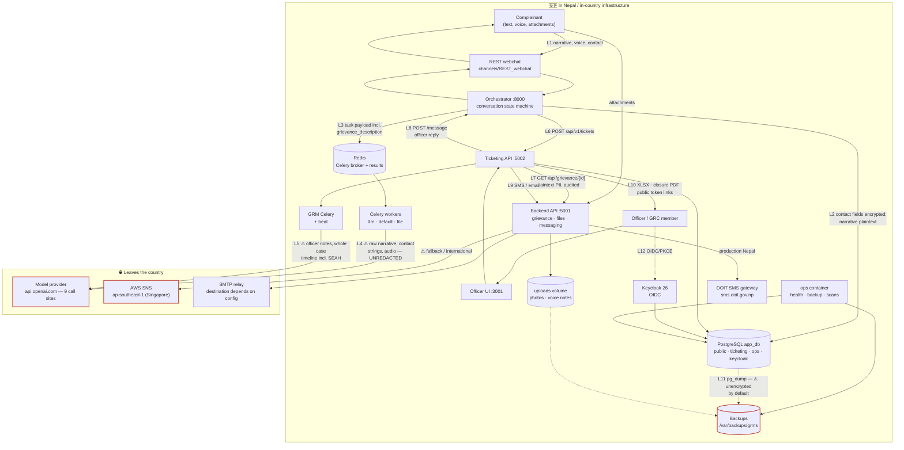

# Privacy assessment and data-flow inventory

**Nepal GRM Platform** — Grievance Redress Mechanism for ADB-financed road infrastructure
(Kakarbhitta–Laukahi Road, ADB Loan 52097-003)

**Version:** 1.0 · **Date:** 2026-08-18 · **Commit:** branch `dpg/sprint0-licensing`
**Benchmark:** Nepal's **Individual Privacy Act, 2075 (2018)** — the sole benchmark (see §0.3)
**Covers:** DPG Standard indicators **7** (privacy), **9** (do no harm) and **9a** (data privacy and security)
**Ticket:** [DPG-04](../sprints/2026-08-llm/01-licensing-and-governance-spec.md#dpg-04)

---

## 0. Read this before anything else

### 0.1 ⚠ Who wrote this, and who has not reviewed it

> **This document was drafted by an AI coding agent** working from the source code of this
> repository. It has **not been reviewed by a lawyer.**
>
> - **Author:** an AI agent (Claude), reading the code directly. Every factual claim about system
>   behaviour below was verified against the code at the file and line cited, not inferred from
>   documentation. Where a claim could not be verified it is marked `⚠ Not verified` or `⚠ Not built`.
> - **Intended reviewer:** ADB's Digital Public Goods consultant, who can advise on the DPG process.
> - **Not reviewed by:** any qualified legal practitioner, Nepali or otherwise. **The DPG consultant
>   is not the implementing agency's counsel and cannot supply a legal opinion.**
>
> **This is therefore a technical inventory with a lay reading of the statute attached. It is not
> legal clearance and must not be relied on as such.** It is written to be the starting document a
> lawyer reads, not the document that replaces one.
>
> Specifically: the **section numbers** cited from the Individual Privacy Act 2018 in §3 were not
> verified against the authoritative Nepali text published by the Nepal Law Commission. The
> **obligations** described are, to the author's knowledge, the ones the Act imposes; the **numbering**
> must be confirmed by counsel before this document is cited anywhere external. Wherever a section
> number appears it is marked `[§ unverified]`.
>
> This marker is required by [engineering rule 9](../engineering/00_engineering_index.md) — never
> write a claim you have not verified — and by the answer to sprint question Q-07. Without it the
> document reads as legal clearance, which is the one thing it is not.

### 0.2 What this document is for

Three audiences, three uses:

1. **A DPG reviewer** assessing indicators 7, 9 and 9a. §2 is the data-flow diagram they asked for;
   §6 is the honest list of what is not yet controlled.
2. **A lawyer** giving the implementing agency an opinion. §1 and §2 are the facts; §3 is the
   question set; §6 is what needs a legal position rather than an engineering one.
3. **This project's own engineers.** §6 is a work list. [DPG-30](../sprints/2026-08-llm/04-pii-redaction-spec.md)
   in Sprint 3 **verifies this inventory against the code** and reports every leg it missed — a
   data-flow diagram nobody checks against reality is a compliance artefact, not a control.

### 0.3 The benchmark, and what does not exist

**Nepal's Individual Privacy Act, 2075 (2018) is the only benchmark.** Verified with the project
owner (sprint question Q-08): there is **no existing DOR or ADB data-sharing agreement** governing
this platform's data, and no departmental privacy policy it must conform to.

That makes this **the first privacy assessment for this platform**, not a conformance check against
something already agreed. It is written accordingly — as a baseline that later documents inherit,
stating positions rather than ticking boxes.

Two adjacent instruments are noted but not assessed here, and a lawyer should confirm whether they
bind: the **Electronic Transactions Act, 2063 (2008)** (confidentiality of electronic records) and
the **National Penal Code, 2074 (2017)** (privacy offences). Nepal also has a **draft data
protection bill** in progress; this assessment describes the law as it stands, not as it may become.

### 0.4 The one change that reshaped this assessment

The earlier plan treated cross-border transfer of grievance text as a **transitional** exposure that
would end when the platform moved to self-hosted models (deployment tier "T2").

**T2 is parked.** There is no owner for GPU running costs (sprint questions Q-03 and Q-05).
Production will run a **hosted third-party model provider indefinitely** (Q-04). The provider may
change; the cross-border transfer does not end.

Consequences that run through this whole document:

- The cross-border position in **§3.7** must justify an **indefinite** arrangement, not a temporary one.
- **Redaction stops being defence-in-depth and becomes the primary control** (§4, §6).
- The **third-party PII question (§4)** is the load-bearing section of this assessment, not an appendix.
- The jurisdiction question that T2 raised (where a self-hosted GPU would sit) is **moot while T2 is
  parked**. The analysis is preserved in
  [`03-open-models-spec.md`](../sprints/2026-08-llm/03-open-models-spec.md#dpg-25) for when it unparks;
  it is not spent here.

### 0.5 ⭐ No genuine grievance has been processed yet — and that is the most important fact in this document

**Confirmed by the project owner, 2026-08-18.** Every grievance record in every environment is either
**AI-generated seed data** (`ticketing/seed/mock_tickets.py` and the demo scenarios) or a **dummy
complaint filed by a participant during a demo**. **No affected person has filed a real grievance
through this platform.**

That single fact reframes the whole assessment, and it cuts both ways:

**What it means the assessment is *not*.** Every exposure described below — the unredacted narratives
crossing a border (§3.7), the third-party names nobody consented to (§4), the plaintext narrative in
backups (F-4), the grievance text in the broker and the logs (F-5, F-6) — is **prospective, not
realised**. No real complainant's words have been sent to a model provider. No real engineer has been
named to a third party. **Nothing in §6 describes harm that has already happened.** A reader who takes
this document as an incident report has read it wrong.

**What it means the assessment *is*.** A list of things that become true on the day the first real
grievance arrives. Which turns the sequencing question into the important one:

> **Sprint 3's redaction work is not remediation. It is a precondition for go-live.**
> Every finding here is cheap to fix now and expensive to fix after real SEAH disclosures are in the
> database, in the backups, and in a provider's 30-day retention window. The window in which these are
> ordinary engineering tasks rather than a breach notification is open **now**, and it closes on first
> production use.

**Two honest caveats, so this is not read as a clean bill of health:**

1. **"Not a real grievance" is not the same as "no real personal data."** A demo participant may have
   entered their **own** genuine phone number, email or name into a dummy complaint — those are real
   contact details of a real person, held under the same conditions as everything else. The
   *narratives* are synthetic; some *contact fields* may not be.
2. **This is a statement about today, and it expires.** It carries a date because it stops being true
   the moment the platform goes live. **Any future version of this document that repeats this section
   without re-confirming it is making a false claim** — and the same is true of the DPG submission if
   the platform launches between writing and review.

---

## 1. What personal data this platform holds

### 1.1 Data subjects

| # | Data subject | How they enter the system | Consented? |
|---|---|---|---|
| 1 | **The complainant** | Submits a grievance through the chatbot, by text or voice | Yes — asked at intake (§3.1) |
| 2 | **Third parties named in a grievance** | Described in the complainant's free-text narrative: a site engineer, a contractor's foreman, a ward official, a named individual accused of misconduct | **No. Never asked.** See §4 |
| 3 | **SEAH survivors, witnesses, and accused persons** | Named in a sensitive-stream disclosure | **No** — same as row 2, at the highest possible sensitivity |
| 4 | **Officers and administrators** | Created by an administrator; identity held in Keycloak | Employment context |
| 5 | **GRC members** | Seeded or created as officers for a project | Employment context |

Rows 2 and 3 are the ones that make this document necessary rather than routine. Row 1 is the case
every grievance mechanism handles; rows 2 and 3 are the case this one creates by accepting free text.

### 1.2 Categories of personal data held

| Category | Fields / artefacts | Where it lives | Protection at rest |
|---|---|---|---|
| **Complainant contact** | `complainant_full_name`, `complainant_phone`, `complainant_email`, `complainant_address` | `public.complainants` | pgcrypto `pgp_sym_encrypt`, hex-encoded — **conditional**, see F-2 |
| **Complainant search tokens** | `complainant_*_hash` — SHA-256 of the four fields above | `public.complainants` | **Unsalted hash** — see F-3 |
| **Grievance narrative** | `grievance_description` — the complainant's own words, in Nepali or English | `public.grievances` | **Plaintext.** Not in `ENCRYPTED_FIELDS` |
| **Derived narrative** | `grievance_summary`, `grievance_categories`, translations | `public.grievances`, cached in `ticketing.tickets` | Plaintext. Summary is free text and **can contain self-disclosed PII** — cached by design; the raw description deliberately is not |
| **Attachments** | Photographs, documents, **voice recordings** | `uploads_data` volume, `uploads/{grievance_id}/` | **Plaintext files on disk** |
| **Location** | Province / district / municipality / ward / village, map-pin coordinates | `public.complainants`, `ticketing.tickets` | Plaintext. A ward-level location plus a narrative is often identifying on its own |
| **Case record** | Officer notes, timeline events, resolution decisions, findings | `ticketing.*` | Plaintext, role-gated |
| **Officer identity** | Username, email, name, credentials, login events | `keycloak` schema | Keycloak-managed |
| **Audit trail** | `ticketing.admin_audit_log`, per-ticket event timeline, contact-reveal actions | `ticketing.*` | Plaintext, admin-gated |
| **Session linkage** | `session_id` on the ticket, linking a case back to a live chatbot conversation | `ticketing.tickets` | Plaintext |

### 1.3 Sensitive personal data

The Individual Privacy Act treats certain categories as requiring stronger protection `[§ unverified]`
— typically caste and ethnicity, religious belief, physical and mental health, and sexual conduct or
orientation.

**This platform holds data in the most sensitive of those categories by design.** The SEAH stream
receives reports of sexual exploitation, abuse and harassment. A single SEAH grievance can contain:
a survivor's account of a sexual assault, their identity or their deliberate anonymity, a named
accused person, a witness, and health information — none of it separable from the free text it
arrives in.

Two controls exist and are real (§3.4). A third — redaction before the text leaves the country —
does not (§4).

### 1.4 The architectural PII boundary — what is genuinely enforced

Three rules are enforced by tests that fail the build, not by convention. They are the strongest
privacy claim this platform can make, and they are worth stating precisely because the rest of this
document is more critical.

| Rule | Enforced by |
|---|---|
| No complainant PII columns in `ticketing.*`, in any form — column, cache, or log | `tests/ticketing/test_pii_boundary.py` |
| The ticketing subsystem holds **no** encryption key and **has no accessor for one** — it cannot decrypt, and cannot learn how | same test |
| The set of `public.*` tables ticketing may touch is **closed and enumerated**, and which of them it writes is pinned | `tests/ticketing/test_boundary_policy.py` |
| No foreign keys from `ticketing.*` into `public.*` | same test |

Complainant PII reaches an officer's screen by exactly one route: `GET /api/grievance/{id}`, which
is authenticated, audited, and decrypts server-side
(`backend/services/database_services/grievance_manager.py:190`). Revealing a phone number is an
explicit, logged action.

---

## 2. Data-flow inventory

### 2.1 Diagram

### 2.2 The legs, verified

Every row was checked against the code at the cited location on 2026-08-18. `⚠` marks a leg where
personal data is exposed beyond what a reader would assume.

| # | Leg | What it carries | Verified at | Assessment |
|---|---|---|---|---|
| **L1** | Complainant → webchat | Free-text narrative, voice recordings, attachments, contact fields, map-pin location | `channels/REST_webchat/` | TLS in transit at the nginx edge. Anonymous submission is supported end-to-end |
| **L2** | Webchat → orchestrator → `public.grievances` / `public.complainants` | As above | `base_manager.py:243` (encrypt), `:255` (decrypt) | Four contact fields encrypted with pgcrypto. **⚠ The narrative is not** — `grievance_description` is stored in plaintext and is the field most likely to contain third-party names |
| **L3** | Orchestrator → Celery → **Redis** | ⚠ Task payloads containing `grievance_description` verbatim, and the raw text of a sensitive-content check | `classification.py:140,153`; `sensitive.py:35-41` | The broker holds unredacted grievance text, including potential SEAH disclosures. Mitigating: the `redis` service declares **no persistence volume**, so payloads are not written to durable storage. They are still in memory and in any process dump |
| **L4** | Celery → **model provider** | ⚠ **The raw grievance narrative** — unredacted. ⚠ **Correction 2026-08-18: not the complainant's name or phone, and not audio** | `LLM_services.py:266` (classification), `:490` (SEAH detection) | **Two reachable call sites, not six.** ⚠ **Corrected twice on 2026-08-18** — first from six to four, then to two, as reachability was established per site rather than counted from the source (D-35, D-37, **D-38**). Unreachable: contact extraction ×2 (nothing enqueues the task), grievance translation (same), and **ASR — switched off by decision**, `registered_tasks.py:157`, *"CB-01 proto: store audio only"*. The live contact path is deterministic (`actions/services/contact/phone.py`), with no model involved. **An inventory that overstates egress is not a safe error**: a reviewer who finds one phantom row has reason to distrust the rest. What does leave, twice per grievance: the narrative — which may contain contact details the complainant typed *inside it*, and that is Sprint 3's subject. See §4 |
| **L5** | Ticketing Celery → **model provider** | ⚠ Officer case notes verbatim; **the whole case timeline, including SEAH cases** | `ticketing/clients/llm_client.py:121,203,305` | **Three call sites.** Same destination, second independent client. A reviewer who redirects one and finds the other is entitled to distrust the rest of the submission. ⏳ **Re-pointed 2026-08-18 (DPG-12):** that reviewer's test now passes — both surfaces read one registry, and a test constructs both factories from one env change to prove it (T-17-d). **The content leaving the country is unchanged**; redaction is Sprint 3 |
| **L6** | Chatbot → ticketing webhook | Grievance reference, summary, categories, location, priority | `backend/actions/utils/ticketing_dispatch.py` | Internal, non-PII by design. `grievance_summary` is free text and **can** carry self-disclosed PII — cached deliberately; the raw description is not |
| **L7** | Ticketing → `GET /api/grievance/{id}` | **Plaintext complainant PII** | `grievance_manager.py:190`; `routers/grievance.py` | Server-side decryption at a single boundary; authenticated with an API key; the read is audited. This is the platform's strongest privacy control |
| **L8** | Ticketing → orchestrator `POST /message` | Officer's reply text to the complainant | `ticketing/clients/orchestrator.py` | Internal. Officer-authored content |
| **L9** | Ticketing → Messaging API → SMS / email | Complainant phone number and message body | `messaging.py:145-148`, `:280`, `:330` | **Production Nepal uses the DOIT government gateway** (`sms.doit.gov.np`) — in-country. ⚠ **The fallback is AWS SNS in `ap-southeast-1` (Singapore)** — a second, quieter cross-border leg carrying a phone number and a message about a grievance. Email goes to an SMTP relay whose destination depends on configuration |
| **L10** | Reports and closure documents | XLSX exports of case data; a closure PDF | `report_export.py`, `closure_pdf.py`, `report_shares.py` | ⚠ The **public closure endpoint is unauthenticated**, gated only by a UUID4 token in the URL, with **no expiry** (`public_closure.py:19,39`). Report shares use `secrets.token_urlsafe(24)` — adequate entropy — but also do not expire |
| **L11** | Backups | ⚠ Full `pg_dump` of `app_db` **plus a tar of the uploads volume** | `scripts/ops/backup_db.sh:45-60` | Contact columns remain ciphertext inside the dump. **The narrative, all officer notes, and every voice recording and photograph are in the clear.** Encryption is **optional and off unless `BACKUP_GPG_RECIPIENT` or `BACKUP_PASSPHRASE` is set**. Retention 14 days. Off-box copy optional; **destination unspecified in the repo** — a deployment fact this document cannot verify |
| **L12** | Auth | Officer usernames, emails, names, credentials, login and failure events | `docker-compose.grm.yml:48`, `keycloak` schema | Self-hosted Keycloak, same database, same host. No third-party identity provider — worth stating, it is a real jurisdictional advantage |
| **L13** | Ops monitoring | Aggregate counts only — grievances submitted, tickets resolved, logins, reveal events | `ops/reports.py:36-58` | ✅ **Verified PII-free.** Every query is a `count(*)`. The daily ops email carries no personal data |

### 2.3 What is *not* on this diagram, and should be

Named so that the omission is deliberate rather than an oversight:

- **Application logs.** Grievance text reaches log lines in at least two known places — translation
  error paths interpolate the whole input dict including `grievance_description`
  (`LLM_services.py:351,345`), and `parse_llm_response` logs the raw model response on a JSON parse
  error (`LLM_services.py:298`). Logs go to the Docker `json-file` driver (10 MB × 5 per service) and
  to a `logs/` directory. **This is a real, live PII sink that no diagram box captures.** Owned by
  [DPG-34](../sprints/2026-08-llm/04-pii-redaction-spec.md).
- **The Celery result backend.** Task results land in Redis DB 2. Whether any result carries
  grievance text has **not** been exhaustively verified. `⚠ Not verified` — DPG-30's job.
- **The staging environment.** AWS staging (`nepal-gms-chatbot.facets-ai.com`) runs on infrastructure
  outside Nepal. ✅ **Answered 2026-08-18 (§0.5): it holds no genuine grievance data** — seeded and demo
  records only, as does every other environment. Had the answer gone the other way, real complainant
  data on a staging box abroad would have been a cross-border transfer separate from the one analysed
  in §3.7. **It is worth keeping this box on the diagram anyway**, because the answer expires at
  go-live and the box is where it would then reappear.

---

## 3. Assessment against the Individual Privacy Act, 2075 (2018)

> Section numbers below are marked `[§ unverified]` — see §0.1. The obligations are stated by topic
> so the assessment survives a renumbering.

### 3.1 Lawful basis and consent `[§ unverified — consent for collection]`

**What the Act requires:** personal information may not be collected without the consent of the
person concerned, and collection must be for a stated purpose.

**What is built:** consent is asked at intake and recorded as data, not merely implied by use.
`complainant_consent` and `complainant_location_consent` are slots collected during the conversation
(`backend/actions/services/contact/required_slots.py:21,46`) and persisted with the grievance
(`action_submit_grievance.py:234`). The SEAH stream carries its own, narrower consent fields —
`seah_contact_consent_channel`, `seah_focal_reporter_consent_to_report`, and an explicit
`seah_anonymous_route` (`:198,211,228-231`). A separate `otp_consent` gates phone verification, and
declining it does not block submission (`form_otp.py:77,181`).

**Assessment: 🟢 the mechanism is genuinely built, and better than most.** Consent is granular,
recorded per grievance, and refusable without losing the ability to complain — which matters for a
grievance mechanism, where making consent a condition of complaining would make it meaningless.

**Two questions for counsel:**

1. **Is the consent informed enough?** The complainant consents to the *grievance mechanism*
   processing their data. **They are not told that their words will be sent to a commercial AI
   provider outside Nepal.** Whether consent to the mechanism covers that transfer is a legal
   question, not an engineering one. Engineering's view: it should be disclosed at intake regardless
   of the answer, and that is cheap to add.
2. **Can a complainant with low literacy, using a phone in Nepali, give informed consent to a
   cross-border data transfer through a chat interface?** Stated because it is the honest question,
   not because the code can answer it.

### 3.2 Purpose limitation `[§ unverified — use for other purposes]`

**Required:** information collected for one purpose may not be used for another.

**Built:** the operational purposes are tight — routing, classification, escalation, resolution,
reporting to oversight bodies. Quarterly reports go to named roles rather than being generally
available.

**⚠ One use is arguably outside the collection purpose:** grievance text is sent to a third-party
model provider. The *purpose* is still grievance handling (classification and summarisation), so this
is probably processing rather than repurposing — **but it is a transfer to a processor the
complainant was not told about**, and whether the provider may use the content for its own purposes
depends on contract terms this repository does not record.

**Action:** the provider's data-use and retention terms should be recorded as evidence. Engineering
cannot assert them; they are a commercial fact. `⚠ Not verified.`

### 3.3 Confidentiality and security of personal information `[§ unverified — protection duty]`

**Required:** the holder must make appropriate arrangements to protect personal information.

**Built — and this is where the platform is strongest:**

| Control | Status |
|---|---|
| Contact PII encrypted at rest (pgcrypto symmetric) | 🟢 built, **conditionally** — see F-2 |
| TLS in transit at the edge | 🟢 built (nginx, certbot) |
| Server-side decryption at a **single** boundary | 🟢 built and pinned by test |
| Ticketing holds no key and has no accessor | 🟢 built and pinned by test |
| Officer access via OIDC/PKCE with role and jurisdiction gates | 🟢 built |
| Auth fails **closed** — services refuse to boot without their auth prerequisites | 🟢 built (HR-01) |
| Contact reveal is an explicit, audited action | 🟢 built |
| Full admin audit log and per-ticket event timeline | 🟢 built |
| Nightly dependency CVE scan and licence scan | 🟢 built |

**Gaps, all in §6:** conditional encryption (F-2), unsalted search hashes (F-3), unencrypted backups
by default (F-4), grievance text in the broker (F-5) and in logs (F-6).

### 3.4 Sensitive personal data

**Built, and this is the control the platform was designed around:**

- The SEAH stream is **access-isolated**: cases are visible only to officers cast on the sensitive
  workflow. Administrators can *configure* those workflows and **cannot read the cases** — the
  separation is structural, not procedural.
- **Anonymous submission is supported end-to-end**, including an explicit `seah_anonymous_route`.
- **Two independent sensitive-content detection paths**, not one: a deterministic scored keyword
  detector running synchronously as slot validation inside the conversation
  (`backend/shared_functions/keyword_detector.py:259`, scored at `:343`), and an LLM check running
  asynchronously as a second pass. A model outage therefore degrades the second pass rather than
  removing detection.

**⚠ The gap is severe and must not be softened:** a SEAH disclosure — potentially a survivor's
account of a sexual assault, naming an accused person — **is transmitted verbatim to a commercial
model provider outside Nepal** on both the intake path (`LLM_services.py:399`) and the case-summary
path (`llm_client.py:305`). The access isolation that protects it inside this platform does not
follow it out. See §4.

### 3.5 Data-subject rights: access, correction, erasure

| Right | Status |
|---|---|
| **Access** — a complainant retrieving their own grievance | 🟡 **Partial.** A status-check flow exists in the chatbot and returns case status; there is no export of everything held about the person |
| **Correction** | 🟡 **Partial.** A modify-grievance flow exists during intake; there is **no** post-submission correction route for a complainant |
| **Erasure / deletion** | 🔴 **Not built, anywhere.** See below |
| **Objection to processing** | 🔴 Not built |
| **Withdrawal of consent** | 🔴 Not built — consent is recorded at intake and never revisited |

**On erasure, precisely.** [`docs/ARCHIVING_AND_RETENTION.md`](../ARCHIVING_AND_RETENTION.md) is a
real, implemented policy — but it is an **archiving** policy, and it says so: §5.3 lists what is
"retained (never deleted in v1)" — every ticket event, every resolved summary, report rows,
attachment metadata, the storage blob ("tier/move, not delete"), and "PII in `complainants` / vault
— Yes, tighter reveal policy". §10 puts "hard delete of grievances, PII, or blobs" explicitly **out
of scope for v1**.

**So: there is no deletion capability in this platform at all.** Not a missing UI over a working
backend — no code path deletes personal data. If a data subject has a right to erasure under the
Act, this platform cannot currently honour it, and no amount of policy writing changes that.

**Engineering's view on the tension, stated rather than resolved:** a grievance mechanism has real
reasons to retain — evidentiary value, oversight reporting, and protecting a complainant against
later denial that they ever complained. Those reasons are legitimate and may well justify retention
under the Act. **But the justification has to be made, and a retention period has to be chosen.**
"Never delete, and nobody decided that" is not a retention policy; it is the absence of one.
**This needs a legal position (§6, F-7).**

### 3.6 Restriction on disclosure `[§ unverified — disclosure without consent]`

**Required:** personal information held by a body may not be disclosed to third parties without
consent, subject to specified exceptions.

**Built:** role-based access with jurisdiction scoping; SEAH isolation; contact reveal audited;
quarterly reports to named oversight roles only; officer accounts individually provisioned.

**⚠ Two disclosure surfaces to review with counsel:**

1. The **unauthenticated public closure endpoint** (`public_closure.py:19`) — anyone holding the URL
   can read a case's public closure summary and download its PDF. That is deliberate: the complainant
   needs to see their outcome without an account. But the token is a UUID4 that **never expires**, and
   a forwarded link is a permanent disclosure. Adding an expiry is cheap.
2. **Quarterly report recipients include ADB roles** — an international financial institution, i.e.
   an entity outside Nepal. Whether reporting to the financier is a permitted disclosure (very
   plausibly yes, as the project's own accountability mechanism) is a legal question worth an
   explicit answer rather than an assumption.

### 3.7 Cross-border transfer — **the indefinite arrangement**

**What the Act says:** the Individual Privacy Act 2018 does **not** contain a dedicated cross-border
transfer regime comparable to GDPR Chapter V, and Nepal has **no data protection authority** to
notify or seek adequacy findings from. `⚠ This is the author's understanding and is exactly the kind
of statement that needs a lawyer.` The general obligations — consent, purpose limitation, the duty to
protect — do not stop at the border, so they are the frame this section uses.

**The facts, verified:**

| Leg | Destination | Frequency | Data |
|---|---|---|---|
| 6 chatbot model calls | `api.openai.com` (United States) | **Every grievance classified** | Full narrative, complainant name and phone, audio |
| 3 ticketing model calls | `api.openai.com` (United States) | Every case summary, findings generation, note translation | Officer notes, whole case timeline, **including SEAH cases** |
| SMS fallback | AWS SNS `ap-southeast-1` (Singapore) | When the DOIT gateway is not in use | Complainant phone number and message body |
| Staging environment | AWS, outside Nepal | Continuous | `⚠ Unknown whether real data — see §2.3` |

#### 3.7.1 The trigger is **transmission**, not what the provider does afterwards

This is the easiest thing in the whole assessment to get wrong, so it is stated before the position:

> **Sending personal data to a third party is itself a disclosure and a cross-border transfer.** It
> needs a lawful basis whether the recipient keeps the data for thirty days or discards it in a
> microsecond. "They don't train on it" and "they delete it after 30 days" are **mitigations to cite,
> not answers to rely on.**

Two corollaries that a reader is likely to reach for and should not:

- **Openness is a licensing property, not a privacy one.** Sprint 2 moves the default to open-weights
  models. That answers DPG indicator 4 and changes **nothing** in this section: an open model served
  by a third party has exactly the same data flow as a commercial one. Anyone tempted to write "we
  moved to open models, so the privacy concern is addressed" should reread this paragraph.
- **A no-retention commitment does not make the transfer not a transfer.** It reduces the residual
  risk after the transfer has already happened.

**Four legs that are easy to miss, and belong in the analysis:**

| Leg | Why it matters | Status here |
|---|---|---|
| **The provider's own retention** | Providers commonly hold API inputs ~30 days for abuse monitoring and billing, and some reserve service-improvement use absent an explicit opt-out. That is a second copy of the grievance, held abroad, under someone else's policy | `⚠ Not verified.` The contract terms are a commercial fact this repository does not record. **They must be obtained and filed as evidence** — and cited as mitigation, never as the answer |
| **Jurisdiction of execution** | Which physical country the inference runs in is **not controlled even by pinning a provider** — routed and multi-region inference is normal. A "US provider" may execute anywhere the provider chooses | `⚠ Not controlled and not currently knowable.` State it rather than implying the destination is a single known country |
| **Prompt caching** | Several providers cache prompt prefixes to cut cost and latency. That parks content somewhere, briefly, outside the request/response the diagram draws | `⚠ Not verified` for the current provider. Note when the Sprint 2 provider is chosen |
| **The re-identification mapping** | Sprint 3's redaction replaces identifiers with tokens and keeps a mapping so replies can be restored. **That mapping is personal data in its own right** — arguably the most concentrated personal data in the system, since it is identifiers with nothing else attached | ⚠ Not built yet. **Its in-country residency is the entire basis of the future claim that only pseudonymised text crosses the border.** If the mapping ever leaves Nepal, or is ever persisted where the transfer boundary can reach it, the claim collapses. [Q-12b](../sprints/2026-08-llm/04-pii-redaction-spec.md#dpg-31) — prefer never persisting it |

#### 3.7.2 ⚠ Terminology: **pseudonymised, never anonymised**

When Sprint 3's redaction lands, the text sent to the model provider will be **pseudonymised, not
anonymised**, and this document, every briefing to the ministry, and every submission text must use
the first word and never the second.

The distinction is not pedantry — it decides the legal category. **Anonymised** data is no longer
personal data and falls outside the Act. **Pseudonymised** data is still personal data, because
someone holds a key that reverses it. **We hold that key**, by design, so that officer replies can be
restored to the complainant. Therefore:

- Redacted grievance text remains personal data after redaction.
- Every obligation in §3 continues to apply to it.
- The transfer analysis in §3.7 is **not** discharged by redaction; it is mitigated by it.

Anyone who writes "anonymised" in a document describing model-bound text has, in one word, asserted
that the Act does not apply. It does.

*(Note: "anonymous" elsewhere in this document — §2.2 L1, §3.4 — refers to a complainant choosing not
to give their identity at intake. That is a different thing and the word is correct there.)*

#### 3.7.3 Position

1. **This is permanent, not transitional.** Earlier drafts of this project's documents described the
   model-provider transfer as a stepping stone to self-hosting. **It is not.** T2 is parked for lack
   of a cost owner. The provider will change (Sprint 2 moves to open-weights models on a hosted
   provider); the transfer will not stop. Any submission text implying otherwise is false and must be
   corrected.
2. **The transfer is currently unredacted.** The complainant's own words, their name and phone, and
   third-party names all leave the country as written. There is no technical control at that boundary
   today.
3. **The mitigation is specified, scheduled, and partial — but less partial than an earlier draft of
   this section claimed.** Sprint 3
   ([DPG-31](../sprints/2026-08-llm/04-pii-redaction-spec.md#dpg-31), DPG-33, DPG-34) builds
   deterministic redaction at the transmission boundary. That covers **more than numeric patterns**:
   alongside phone numbers, emails, citizenship and vehicle-registration numbers, §31.2b ships **three
   person-name recognisers that need no ML at all** — honorific and role-title triggers (`श्री`, `Er.`,
   Engineer, overseer, ward chairperson), a **Nepali family-name (thar) gazetteer**, and
   self-identification patterns (*"my name is …"*, `मेरो नाम … हो`). **In this domain the fraction the
   rule layer catches is the fraction that matters most — the named official**, who is exactly the
   person who never consented.
   **What still gets through:** a name with no title, no recognisable surname and no self-identification
   frame — *"the man operating the roller"*, later named in passing — or an unusual surname the
   gazetteer does not carry. The ML model (Q-12c / consultant-Q9) raises recall; **it is not the whole
   of name redaction, and treating it as such was a scoping error this project has already made once.**
   So the honest claim is *"most names are removed, some get through, and we will publish the measured
   residual"* — not *"names are unaddressed"*, and not *"names are handled"*.
4. **What is genuinely in Nepal:** identity (self-hosted Keycloak), the database, uploads, the
   production SMS gateway (DOIT), and all application logic. The platform is not dependent on a
   foreign cloud for its operation. The model provider is the exception, and it is the only one.

### 3.8 Accountability and governance

**Required:** an identifiable controller responsible for the information `[§ unverified]`.

**⚠ The controller is not formally identified.** The implementing agency (DOR) is the natural
controller and the platform is destined for DOR infrastructure
(`grm-chatbot.dor.gov.np`) — but there is no document naming a data controller, a data protection
officer, or a responsible official.

This overlaps a question already formally open: **who owns this code** is with ADB's Office of the
General Counsel ([DPG-03](../sprints/2026-08-llm/01-licensing-and-governance-spec.md#dpg-03)).
Ownership of code and controllership of data are different questions with the same set of parties,
and it is efficient to ask them together.

---

## 4. Third-party PII — the load-bearing question

**This section is the one that cannot be deferred**, and with T2 parked it carries more weight than
any other part of this assessment.

### 4.1 The problem, stated plainly

A road-sector grievance is *about* someone. Realistic narratives:

> "The contractor's foreman, Ram Bahadur, told us the compensation was already paid to the ward
> office. Engineer Sharma was there and said nothing."

> "The driver of the tipper that hit my son works for the subcontractor. His name is —."

> A SEAH disclosure naming an accused worker, a supervisor who ignored the report, and a witness.

**The complainant consented to give *their* details. Nobody asked Ram Bahadur.** He does not know the
grievance exists, has not consented to his name being stored, cannot exercise access or correction
rights he does not know he has, and — today — his name is transmitted to a commercial AI provider in
the United States as part of the narrative.

This is a **different legal category** from complainant PII. Every consent-based argument in §3.1
protects the complainant and protects no one else.

### 4.2 Why this is not solved by the existing controls

| Control | Why it does not reach third parties |
|---|---|
| Consent at intake | Consent of the wrong person. The complainant cannot consent on the engineer's behalf |
| pgcrypto encryption of contact fields | Encrypts the **complainant's** four contact fields. A third-party name inside `grievance_description` is plaintext, and the description is not an encrypted field |
| The `ticketing.*` PII boundary | Governs *complainant* PII columns. A third-party name arrives as free text inside the narrative and inside cached summaries; no column-level rule catches it |
| SEAH access isolation | Protects the case **inside** the platform. It does not follow the text to the model provider |
| Deterministic redaction (Sprint 3) | **Reaches third-party names, imperfectly** — §31.2b's honorific/role-title triggers are aimed squarely at the named official, and the thar gazetteer plus self-identification patterns cover much of the rest. **This is the one control in this table that does bite on third parties**, which is why the residual has to be measured rather than described. What escapes it: an untitled name with an unusual surname, mentioned in passing |

### 4.3 Position

1. **This is acknowledged as a real and currently uncontrolled exposure.** It is not argued away.
2. **The lawful basis for holding third-party data is different from the complainant's**, and needs a
   legal position. Engineering's non-legal reading: processing a grievance necessarily involves
   information about the person complained of — a mechanism that could not name anyone could not
   function — so a legitimate-purpose argument is available. **Whether the Act accommodates that, and
   on what conditions, is for counsel.**
3. **Even granting the basis for *holding* it, the *transfer* of it is separate.** Holding a named
   engineer's details in a Nepali government grievance database is one thing; sending them to a US
   commercial AI provider is another. This is where a legal position is most needed.
4. **The technical control is specified, scheduled, and partial — and it does reach names.** Sprint 3's
   deterministic layer includes the three person-name recognisers in §31.2b, tuned for **recall** on the
   principle that a missed name is a privacy breach while an over-redacted common noun is a small
   classification cost. **An earlier draft of this document said person names were deferred entirely to
   the ML initiative. That was wrong** — the same error this project made once before and corrected
   (sprint deviation D-08) — and it matters, because it is the difference between *"we do nothing about
   names"* and *"we do most of it and will publish the residual"*. Neither overclaim is acceptable in a
   submission; the measured number is the answer to both.
5. **A disclosure-at-intake obligation may follow.** If a complainant is told their words go to an
   external AI service, they can choose what to write. That is a partial mitigation available today at
   the cost of one screen of copy, and it does not depend on any legal answer.

---

## 5. Retention, deletion, and breach

### 5.1 Retention — implemented, but it is archiving, not retention

**Built** ([`docs/ARCHIVING_AND_RETENTION.md`](../ARCHIVING_AND_RETENTION.md), implemented 2026-06-08):
resolved cases become `archived` after a configurable cooling period, with a separate SEAH override;
archived cases leave officer queues; attachments tier to colder storage; reveal-contact on archived
cases narrows to `super_admin`; all reveals audited; a daily job; settings changes audited.

**Not built:** any deletion, of anything, ever (§3.5).

**What is needed, and it is a legal decision not an engineering one:**

- [ ] A **retention period** per data category, with the reason for each
- [ ] A **separate SEAH retention position** — longer for evidentiary value, or shorter to limit exposure? This is a genuine trade-off and it needs an owner
- [ ] A **deletion procedure**, and the code to execute it
- [ ] **Legal hold** — already designed as a future field on the ticket, not yet built
- [ ] **Backup retention alignment** — backups keep 14 days; if a record is deleted, it survives in backups until they roll. Say so rather than discovering it later

### 5.2 Deletion procedure

**⚠ Not built.** See §3.5. Stated as a gap rather than described as a process.

### 5.3 Breach procedure

**⚠ Not built as a written procedure.** The technical detection substrate exists and is better than
the absence of a policy suggests:

- `ops` runs health checks, a nightly CVE scan, and a nightly licence scan into `ops.dependency_findings`
- Deduplicated alerting to a configured address (`ops/alerts.py:29`)
- A daily ops report covering failed logins and contact-reveal counts (`ops/reports.py:50-58`)
- `ticketing.admin_audit_log` records reveals and administrative actions
- Keycloak login and login-failure events are queryable
- A private vulnerability disclosure channel exists as of this sprint ([`SECURITY.md`](../../SECURITY.md))

**What is missing is the human procedure**, and it is short enough to write once someone can commit
to it:

- [ ] Who decides that an incident is a personal-data breach, and within what time
- [ ] Who must be notified — the implementing agency, ADB, and **affected data subjects**; and for a SEAH breach, whether a survivor is notified directly and by whom, which is a safeguarding decision, not an IT one
- [ ] Notification timeline
- [ ] Containment, evidence preservation, and post-incident review
- [ ] The interaction with [`SECURITY.md`](../../SECURITY.md), which already promises a reporter that we will tell them when a breach procedure is triggered — **that promise is currently written against a procedure that does not exist**, and this document is the place that admits it

---

## 6. Findings register

Every finding was verified against the code on 2026-08-18. Severity is engineering's judgement about
privacy impact, not a legal characterisation.

| # | Finding | Where | Severity | Owner |
|---|---|---|---|---|
| **F-1** | **Grievance narratives, complainant contact details and third-party names are transmitted unredacted to a commercial model provider outside Nepal, on 9 call sites, permanently** | `LLM_services.py` ×6, `llm_client.py` ×3 | 🔴 High | Sprint 3 — DPG-31/33 |
| **F-2** | **Encryption at rest fails open.** `_encrypt_field` returns the **plaintext value unchanged** when `DB_ENCRYPTION_KEY` is unset *and* when the pgcrypto call raises — the error is logged, the write proceeds. A misconfigured or degraded deployment silently stores complainant PII in the clear, and nothing downstream can tell the difference | `base_manager.py:243-252` | 🔴 High | [`storage-layer-privacy-defects.md`](../sprints/2026-08-llm/followups/storage-layer-privacy-defects.md) |
| **F-3** | **Unsalted SHA-256 of phone, email, name and address** stored as `*_hash` search tokens. Nepal's mobile number space is small enough to enumerate exhaustively in seconds; the hash of a phone number is therefore reversible, so these columns are personal data, not pseudonyms | `base_manager.py:502-511`, used at `complainant_manager.py:121` | 🟠 Medium-high | [`storage-layer-privacy-defects.md`](../sprints/2026-08-llm/followups/storage-layer-privacy-defects.md) |
| **F-4** | **Backups are unencrypted by default.** `pg_dump` of the whole database plus a tar of the uploads volume; GPG/passphrase encryption only if an env var is set; off-box destination unspecified in the repo. Contact columns stay ciphertext, but the narrative, all officer notes, and every voice recording and photograph are in the clear | `scripts/ops/backup_db.sh:45-60` | 🟠 Medium-high | [`storage-layer-privacy-defects.md`](../sprints/2026-08-llm/followups/storage-layer-privacy-defects.md) |
| **F-5** | **Grievance text, including potential SEAH disclosures, passes through the Celery broker** in task payloads | `classification.py:140`, `sensitive.py:35` | 🟠 Medium | DPG-34 |
| **F-6** | **Grievance text reaches application logs** — translation error paths interpolate the whole input dict; `parse_llm_response` logs the raw model response on a parse error | `LLM_services.py:298,337,345` | 🟠 Medium | DPG-34 |
| **F-7** | **No deletion capability exists anywhere in the platform**, and no retention period has been chosen. Archiving is implemented and is not deletion | `ARCHIVING_AND_RETENTION.md` §5.3, §10 | 🟠 Medium | **needs a legal position** |
| **F-8** | **No written breach procedure**, while `SECURITY.md` already promises reporters that one will be followed | — | 🟠 Medium | **needs an owner** |
| **F-9** | **Third parties named in grievances have not consented and cannot exercise any right.** The redaction layer *does* reach names (§31.2b — title triggers, thar gazetteer, self-identification), tuned for recall, so this is a **measured residual rather than an untouched gap** — but the residual is real and unquantified until DPG-35 reports it, and no redaction addresses the fact that these people have no rights they can exercise over data already held | §4 | 🟠 Medium | **needs a legal position**; recall figure from DPG-35 |
| **F-10** | **Public closure endpoint is unauthenticated with a non-expiring UUID4 token.** Deliberate design (the complainant has no account) but a forwarded link is a permanent disclosure | `public_closure.py:19,39` | 🟡 Low-medium | new — add expiry |
| **F-11** | **The data controller is not formally identified.** Overlaps the open IP-ownership question with ADB OGC | — | 🟡 Low-medium | DPG-03 |
| **F-12** | **SMS fallback routes a complainant's phone number and message through AWS SNS in Singapore.** Production Nepal uses the in-country DOIT gateway, so this is a fallback path — but it is a cross-border leg nobody had inventoried | `messaging.py:280,330`; `AWS_REGION=ap-southeast-1` | 🟡 Low | new |
| **F-13** | **Intake does not disclose that grievance text is sent to an external AI provider.** Consent is genuinely collected (§3.1) but not for this | `required_slots.py:21,46` | 🟡 Low to fix, high in principle | new — cheap |
| **F-14** | ~~Unknown whether AWS staging holds real complainant data~~ ✅ **ANSWERED 2026-08-18 by the project owner: it does not, and neither does any other environment.** All grievance records are AI-generated seed data or dummy complaints filed during demos (§0.5). ⚠ **Residual, and it is not nothing:** a demo participant may have entered their own genuine contact details, so the *narratives* are synthetic while some *contact fields* may be real. And the answer expires at go-live | §0.5, §2.3 | ✅ Closed, with a dated caveat | — |
| **F-15** | ~~*(Documentation)* `docs/deployment/09_privacy.md` still forbids cross-schema reads from `ticketing.*` into `public.*`~~ ✅ **FIXED 2026-08-18.** The section now states the as-built contract — enumerated closed table set, no FKs, no PII columns, grievance **state** changes over HTTP only — **with T3-07's reason carried alongside it**. Not a one-line deletion: a June doc reorganisation deleted that rationale and left the bare rule, which is how it survived a correction, so the fix had to restore the *why* (engineering rule 7) | `09_privacy.md` §Implementation boundaries | ✅ Closed | — |
| **F-16** | **The model provider's own data terms are not recorded anywhere** — retention window, whether inputs are used for service improvement, and whether prompt caching applies. These are the mitigations any transfer analysis would cite, and citing an unverified mitigation is worse than citing none | commercial fact, not in the repo | ⚠ Unverified | **obtain and file before submission** |
| **F-17** | **Jurisdiction of execution is not controlled and not currently knowable.** Pinning a provider does not pin the country the inference runs in. Any submission text naming a single destination country for the model calls would be a claim we cannot support | §3.7.1 | ⚠ Unverified | state as-is; do not overclaim |

**Two findings were corrected in the same commit as this document rather than logged:**

- A comment in `backend/api/routers/grievance.py` asserted that `GET /api/grievance/{id}` **never
  decrypts** and called it "the T3-04 defect". T3-04 landed; the endpoint decrypts server-side
  (`grievance_manager.py:190`). The comment described the pre-fix state and was never updated —
  in the file a privacy reviewer reads first, about the control this assessment calls the platform's
  strongest. Corrected, with the correction dated in place.
- `NOTICE` claimed the generated dependency-licence inventory "will be published". It was published
  by DPG-02. Corrected.

---

## 7. What DPG-30 must verify

Sprint 3 opens with an egress inventory
([DPG-30](../sprints/2026-08-llm/04-pii-redaction-spec.md)) that checks **this document against the
code** and reports every leg it missed. That check is the reason this diagram is a control rather than
an artefact. It must specifically confirm or refute:

- [ ] That the model call sites are **9**, not more — a tenth would mean this inventory was written against a moving target
- [ ] Whether the **Celery result backend** carries grievance text (`⚠ Not verified` in §2.3)
- [ ] Every log line that can carry grievance text — F-6 lists three, found by reading; a systematic sweep will find more
- [x] ~~Whether **AWS staging holds real data**~~ (F-14) — **answered: no.** DPG-30 should instead verify the *converse*: that nothing has changed, i.e. re-confirm at the time it runs, because §0.5 is a statement with an expiry date
- [ ] The **backup off-box destination and its jurisdiction** (F-4) — a deployment fact, not a code fact
- [ ] Whether `grievance_summary`, which **is** cached into `ticketing.tickets`, carries self-disclosed PII in practice — the asymmetry with `grievance_description` is deliberate, and its cost should be measured rather than assumed
- [ ] The chosen provider's **retention window, service-improvement terms and prompt-caching behaviour** (F-16) — and that they are filed as evidence rather than assumed
- [ ] That the **re-identification mapping** DPG-31 introduces never leaves Nepal and, preferably, is never persisted at all (§3.7.1). It is the single point on which the whole "only pseudonymised text crosses the border" claim rests

---

## 8. Summary

**Genuinely good, and stated first because the rest is critical:** an architecturally enforced PII
boundary pinned by tests that fail the build; a single server-side decryption point; a ticketing
subsystem that cannot decrypt and has no accessor for a key; granular consent that is recorded and
refusable; anonymous submission end-to-end; SEAH access isolation that administrators cannot
circumvent; two independent sensitive-content detection paths; a full audit trail; fail-closed auth;
self-hosted identity; an in-country production SMS gateway; and an implemented archiving policy. For
a platform of this size that is a stronger privacy posture than most, and it was built deliberately.

**The gap is concentrated in one place and one decision.** Grievance text — including SEAH
disclosures and the names of people who never consented — leaves Nepal unredacted on every model
call, **permanently**, because self-hosting has no cost owner. **The transmission is the event that
needs a lawful basis** (§3.7.1) — not the provider's retention, not whether it trains on the data,
and emphatically not whether the model is open-weights, which is a licensing property and changes
nothing here. Every other finding in §6 is smaller
than that one, and several (F-2, F-3, F-4) are ordinary engineering fixes.

**And the timing is the opportunity.** No genuine grievance has been processed yet (§0.5), so nothing
in §6 describes harm that has happened — every item is a thing that becomes true on first production
use. **That makes Sprint 3 a go-live precondition rather than remediation**, and it makes F-2, F-3 and
F-4 cheap now and expensive later. It also puts a deadline on this document: §0.5 expires the day the
platform launches.

**Three things need a decision nobody in this repository can make:** a retention and deletion
position (F-7), a lawful basis for third-party data and its transfer (F-9), and the identification of
a data controller (F-11).

**And the honest closing note:** this document was written by an AI agent reading source code. Its
description of the *system* is verified line by line and should be trusted to that extent. Its
reading of the *law* is a lay reading, section numbers included, and should be trusted no further
than that. The next reader of this document should be a lawyer.

---

## Related documents

| Document | What it adds |
|---|---|
| [`00_compliance_status.md`](00_compliance_status.md) | The full DPG indicator-by-indicator assessment; §3.5 is indicator 7 |
| [`dependency-licenses.md`](dependency-licenses.md) | Generated licence inventory (indicator 2) |
| [`../deployment/09_privacy.md`](../deployment/09_privacy.md) | The privacy *design* spec — data domains, vault, reveal policy |
| [`../deployment/13_security.md`](../deployment/13_security.md) | Security control inventory |
| [`../deployment/14_key_and_secret_lifecycle.md`](../deployment/14_key_and_secret_lifecycle.md) | Key and secret rotation |
| [`../ARCHIVING_AND_RETENTION.md`](../ARCHIVING_AND_RETENTION.md) | The implemented archiving policy |
| [`../sprints/2026-08-llm/04-pii-redaction-spec.md`](../sprints/2026-08-llm/04-pii-redaction-spec.md) | Sprint 3 — the redaction work this assessment scopes |
| [`../../SECURITY.md`](../../SECURITY.md) | Vulnerability disclosure |
