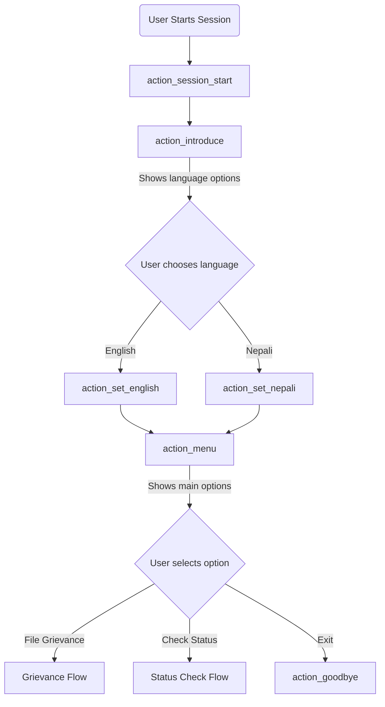
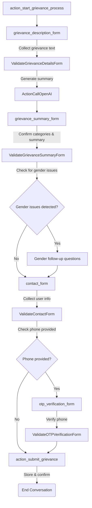
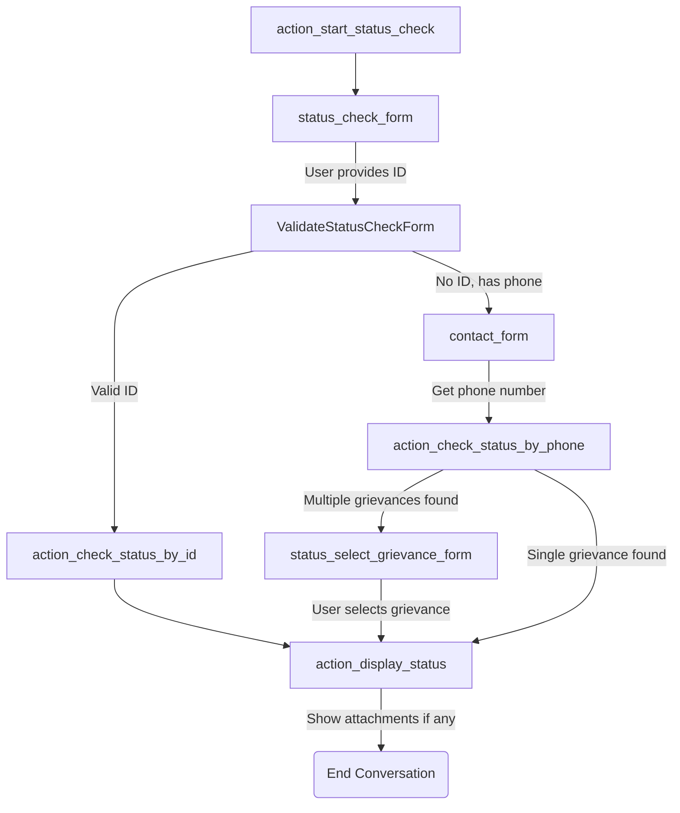

# Nepal Chatbot - Conversation Flow Documentation

This document outlines the typical conversation flows and the interaction between components in the Nepal Chatbot system. The flows are derived from the story patterns in `stories.yml` and action implementations in the various form handling files.

## Core Conversation Flows

### 1. Basic Session Initiation & Language Selection

### 2. Grievance Submission Flow

### 3. Status Check Flow

## Detailed Components

### 1. Form Validation Actions

These form validation actions handle user input validation and slot filling:

#### ValidateGrievanceDetailsForm

- **Purpose**: Validates the grievance details entered by the user
- **Key Methods**:
  - `validate_grievance_new_detail`: Checks if the text is of sufficient length and quality
  - `extract_grievance_new_detail`: Captures the user's grievance description
- **Flow**:
  1. Collects initial grievance text
  2. Validates and checks for skip requests
  3. Appends to existing text if the user is adding more details

#### ValidateGrievanceSummaryForm

- **Purpose**: Handles AI-generated summary and category confirmation by user
- **Key Methods**:
  - `validate_grievance_categories_confirmed`: Processes user confirmation of suggested categories
  - `validate_grievance_summary_confirmed`: Processes user confirmation of summary
  - `_detect_gender_issues`: Automatically detects gender-related grievances
- **Flow**:
  1. Shows AI-generated summary and categories
  2. Allows user to confirm or modify categories
  3. Checks for gender issues that need special handling

#### ValidateContactForm

- **Purpose**: Validates user contact and location information
- **Key Methods**:
  - `validate_complainant_location_consent`: Checks if user agrees to share location info
  - `validate_complainant_municipality_temp`: Validates the user's municipality information
  - `validate_complainant_phone`: Validates phone number format and prepares for OTP verification
- **Flow**:
  1. Collects location consent
  2. If consented, collects province, district, municipality, and other location details
  3. Collects contact information (name, phone, email)
  4. Prepares phone number for verification if provided

#### ValidateOTPVerificationForm

- **Purpose**: Handles phone verification through OTP (One-Time Password)
- **Key Methods**:
  - `validate_otp_input`: Validates the OTP entered by the user
  - `_is_valid_otp_verification_format`: Checks OTP format (6 digits)
  - `_is_matching_otp`: Verifies if input matches expected OTP
- **Flow**:
  1. Generates and sends OTP to user's phone
  2. Validates user-entered OTP
  3. Handles retries and skip requests

### 2. Form Request Actions

These actions generate the prompts and buttons for the various form inputs:

#### Grievance Details Form

- `ActionAskGrievanceDetailsFormGrievanceTemp`: Asks user to provide grievance details
  - **Utterance**: "Please describe your grievance in detail"
  - **Buttons**: "Skip", "Submit as is"

#### Grievance Summary Form

- `ActionAskGrievanceSummaryFormGrievanceListCatConfirmed`: Shows AI-generated categories for confirmation
- `ActionAskGrievanceSummaryFormGrievanceSummaryTemp`: Shows AI-generated summary for editing
- `ActionAskGrievanceSummaryFormGrievanceSummaryConfirmed`: Asks user to confirm the summary
  - **Utterance**: "Is this summary accurate?"
  - **Buttons**: "Yes", "No"

#### Contact Form

- `ActionAskContactFormUserContactConsent`: Asks user for consent to collect contact information
- `ActionAskContactFormUserFullName`: Requests user's full name
- `ActionAskContactFormUserContactPhone`: Requests user's phone number
- `ActionAskContactFormUserLocationConsent`: Asks user for consent to collect location information
  - **Utterance**: "Would you like to share your location information?"
  - **Buttons**: "Yes", "No"

#### OTP Verification Form

- `ActionAskOtpVerificationFormOtpConsent`: Asks user for consent to verify phone number
- `ActionAskOtpVerificationFormOtpInput`: Requests user to enter the OTP sent to their phone
  - **Utterance**: "A verification code has been sent to your number. Please enter it."
  - **Buttons**: "Resend OTP", "Skip verification"

### 3. Final Actions

These actions perform the final steps in the conversation flows:

#### ActionSubmitGrievance

- **Purpose**: Handles final submission of the grievance
- **Key Steps**:
  1. Collects all data from filled slots
  2. Creates or updates grievance in database
  3. Handles attachment information
  4. Generates and stores a unique grievance ID
  5. Provides a confirmation message with the grievance ID
  6. Optional: Sends email confirmation if email provided

#### ActionCheckStatus

- **Purpose**: Retrieves and displays status information
- **Key Steps**:
  1. Validates grievance ID or uses phone number to look up grievances
  2. Retrieves status information from database
  3. Formats and displays status to the user
  4. Shows any attached files if present

## Sample Conversation Flows

### New Grievance Submission (Happy Path)

1. **System**: "Welcome to the Grievance Reporting System. Please select your language."

   - **Buttons**: "English", "नेपाली"

2. **User**: Clicks "English"

3. **System**: "Welcome! How can I help you today?"

   - **Buttons**: "File a Grievance", "Check Status", "Exit"

4. **User**: Clicks "File a Grievance"

5. **System**: "Please describe your grievance in detail."

6. **User**: "The water supply in my area has been inconsistent for the past month. We only get water for 2 hours every day."

7. **System**: "Based on your description, I've categorized your grievance as: WATER SUPPLY. Is this correct?"

   - **Buttons**: "Yes", "No"

8. **User**: Clicks "Yes"

9. **System**: "Here's a summary of your grievance: 'Inconsistent water supply for the past month, limited to 2 hours daily.' Is this accurate?"

   - **Buttons**: "Yes", "No"

10. **User**: Clicks "Yes"

11. **System**: "Would you like to provide your contact information so we can update you about your grievance?"

    - **Buttons**: "Yes", "No"

12. **User**: Clicks "Yes"

13. **System**: "Please provide your full name."

14. **User**: "John Smith"

15. **System**: "Please provide your phone number."

16. **User**: "+9779812345678"

17. **System**: "We'll send a verification code to this number. Do you wish to continue?"

    - **Buttons**: "Yes", "No"

18. **User**: Clicks "Yes"

19. **System**: "A verification code has been sent to your number. Please enter it."

20. **User**: "123456"

21. **System**: "Would you like to share your location information?"

    - **Buttons**: "Yes", "No"

22. **User**: Clicks "Yes"

23. **System**: [Location collection flow with province, district, municipality, etc.]

24. **System**: "Thank you! Your grievance has been submitted successfully. Your grievance ID is GR20250415ABC123. You will receive updates on the status of your grievance."

### Status Check Flow

1. **System**: "Welcome! How can I help you today?"

   - **Buttons**: "File a Grievance", "Check Status", "Exit"

2. **User**: Clicks "Check Status"

3. **System**: "Do you have a grievance ID?"

   - **Buttons**: "Yes", "No"

4. **User**: Clicks "No"

5. **System**: "Please provide your phone number that you used when filing the grievance."

6. **User**: "+9779812345678"

7. **System**: "We found 1 grievance associated with this phone number. The status of your grievance GR20250415ABC123 is: IN PROGRESS. Last updated on 15 April 2025."

## Exception Flows

### Skip Flow in Grievance Submission

If a user wants to skip providing certain information:

1. **System**: "Please provide your email address."

2. **User**: "skip"

3. **System**: "You've chosen to skip this step. Your email will not be collected."
   [Continues to next step]

### OTP Verification Failure

If OTP verification fails:

1. **System**: "Please enter the verification code sent to your phone."

2. **User**: "123456"

3. **System**: "The code you entered is incorrect. Please try again or click Resend OTP."

   - **Buttons**: "Resend OTP", "Skip verification"

4. **User**: Clicks "Resend OTP"

5. **System**: "A new verification code has been sent to your number. Please enter it."

### Grievance Category Modification

If the user wants to modify the suggested categories:

1. **System**: "Based on your description, I've categorized your grievance as: WATER SUPPLY. Is this correct?"

   - **Buttons**: "Yes", "No"

2. **User**: Clicks "No"

3. **System**: "Please select the correct category:"

   - **Buttons**: [List of categories]

4. **User**: Selects "SANITATION"

5. **System**: "Your grievance has been categorized as: SANITATION. Is this correct?"

   - **Buttons**: "Yes", "No"

6. **User**: Clicks "Yes"
   [Continues with the flow]
